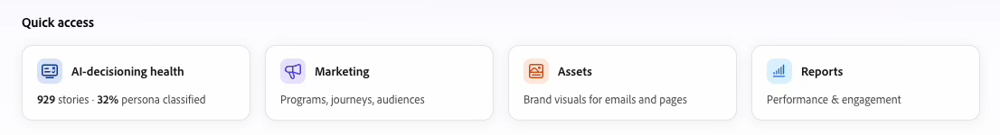
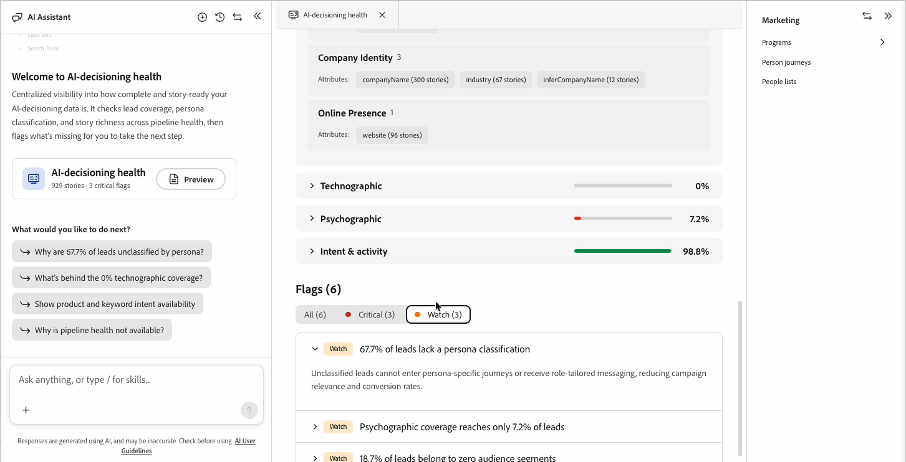

# Integridade da decisão sobre IA

A integridade da decisão de IA verifica os dados que possibilitam a personalização em [!DNL Adobe Marketo Optimizer]. Ele relata a cobertura de leads, classificação de persona e riqueza de histórias em categorias demográficas, firmográficas, tecnográficas e psicográficas. Em seguida, ele sinaliza os dados ausentes para identificar onde iniciar.

Use a integridade do AI-decisioning para ver quais dados fluem do [!DNL Marketo Engage] e onde existem lacunas. Fechar essas lacunas melhora a maneira como a [decisão sobre IA](./ai-decisioning.md) classifica e encaminha cada pessoa.

## Integridade aberta da decisão sobre IA {#open}

Abra o relatório na página inicial ou no bate-papo do Colaborador.

* Na página _Página inicial_, selecione o cartão de **[!UICONTROL Integridade da decisão de IA]** na linha Acesso rápido. O cartão lidera a linha e mostra o volume da história e o progresso da classificação de persona, como 929 histórias, 32% classificadas por persona.
* Na caixa de chat do Colaborador, pergunte diretamente sobre seus dados de personalização ou digite `/` e selecione **[!UICONTROL Integridade da decisão de IA]**.

{width="600"}

Ambos os caminhos abrem o relatório dentro do espaço de trabalho do Colaborador.

## Avisos de boas-vindas e acompanhamento do chat {#chat-welcome}

Abrir a integridade da decisão de IA pelo chat exibe uma mensagem de boas-vindas, _[!UICONTROL *Bem-vindo à integridade da decisão de IA]_, um resumo das verificações de relatório e um cartão para abrir o relatório completo.

Abaixo do cartão, em _[!UICONTROL O que você gostaria de fazer a seguir?]_, a integridade da decisão de IA sugere prompts de acompanhamento com base nas lacunas específicas dos seus próprios dados. Por exemplo, se 67,7% de seus clientes potenciais não tiverem uma classificação de persona, um prompt sugerido exibirá _Por que 67,7% dos clientes potenciais não estão classificados pela persona?_ Selecione um prompt sugerido ou faça sua própria pergunta para obter uma resposta direta sem sair do chat.

{width="800" zoomable="yes"}

## Visão geral do relatório {#report-overview}

O relatório do espaço de trabalho é aberto com uma chamada **[!UICONTROL Destaques]** que lista as áreas mais fortes e fracas de seus dados em linguagem simples, como _Dados demográficos atingem 100% dos clientes potenciais com forte profundidade de campo_ ou _67,7% dos clientes potenciais permanecem não classificados em qualquer persona_. Uma marca de seleção marca um resultado saudável e um círculo cortado marca uma lacuna.

Ao lado dos destaques, um gráfico de radar representa a **[!UICONTROL Cobertura]** geral em seis dimensões: demográfica, firmográfica, tecnográfica, psicográfica, pessoal e intenção. Uma área sombreada maior significa uma cobertura mais ampla.

## Classificação pessoal {#persona-classification}

A seção **[!UICONTROL Classificação pessoal]** mostra quantas de suas histórias são classificadas em persona. Por exemplo: _300 de 929 histórias classificadas · 32,3% classificadas · 67,7% não classificadas_. Uma barra empilhada quebra histórias classificadas por persona, com uma legenda mostrando a contagem de histórias e a porcentagem de cada uma.

Selecione um segmento de persona para abrir um cartão de detalhes com exemplos de títulos de cargo para essa persona. Por exemplo, o segmento **[!UICONTROL Outros]** pode mostrar: _272 histórias / 29,3%_, com exemplos como Especialista do Setor, Consultor Independente, Consultor Autônomo e Especialista no Assunto.

## Cobertura {#coverage}

A seção **[!UICONTROL Cobertura]** lista cinco categorias de dados: demográfico, firmográfico, tecnológico, psicográfico e intenção e atividade. Cada categoria mostra a porcentagem de histórias com pelo menos um atributo disponível nessa categoria.

Selecione uma categoria para expandi-la e escolha uma das duas guias:

* **[!UICONTROL Atributos]** - Atributos agrupados por tipo, como Detalhes Pessoais ou Localização, em demográfico. Cada atributo mostra quantas histórias possuem um valor, por exemplo: `firstName (906 stories)`.
* **[!UICONTROL Sinalizadores]** - Intervalos específicos dessa categoria ou _Não há sinalizadores abertos nesta categoria_ quando a cobertura está íntegra.

Use o campo de pesquisa acima da lista de categorias para ir diretamente para uma categoria ou atributo por nome.

{width="800" zoomable="yes"}

## Sinalizadores {#flags}

A seção **[!UICONTROL Sinalizadores]** na parte inferior do relatório lista todas as lacunas encontradas em todas as categorias, classificadas por gravidade:

* **[!UICONTROL Crítico]** - Lacunas que bloqueiam completamente um recurso, como _A cobertura tecnológica é 0% em todos os clientes potenciais_.
* **[!UICONTROL Atenção]** - Falhas que reduzem a eficácia, mas não bloqueiam um recurso, como _A cobertura psicográfica atinge somente 7,2% dos clientes potenciais_.

Filtre a lista por gravidade e selecione um sinalizador para expandi-la e leia uma explicação em uma frase sobre seu impacto nos negócios, por exemplo: _Clientes potenciais não classificados não podem inserir jornadas específicas de persona nem receber mensagens personalizadas, reduzindo a relevância da campanha e as taxas de conversão._

{width="800" zoomable="yes"}

## Acessado recentemente {#recently-accessed}

Se você abrir a integridade da decisão de IA e sair, ela aparecerá em **[!UICONTROL Acessado recentemente]** no espaço de trabalho vazio, para que você possa voltar para o relatório sem voltar para a página inicial.

{width="500"}

>[!BEGINSHADEBOX]

As melhorias planejadas para a integridade da decisão de IA incluem:

* Uma entrada dedicada no catálogo de habilidades do Colaborador.
* Ações guiadas de &quot;perguntar como&quot; que orientam você na correção de um sinalizador.
* Uma guia dedicada às próximas etapas.

>[!ENDSHADEBOX]
