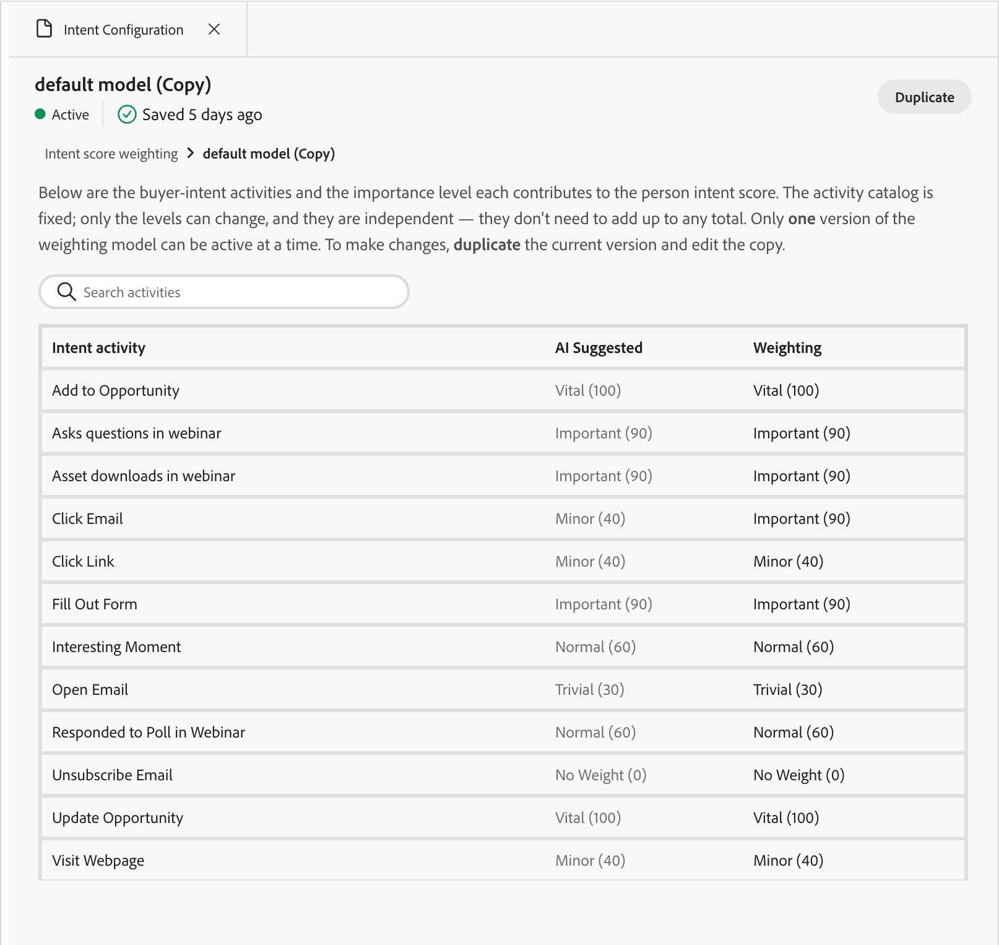

# Configuração de intenção

Um único conjunto padronizado de pesos de atividade não funciona entre clientes. O que indica a intenção de compra real varia de acordo com o negócio. Configure e ative um modelo de intenção para especificar o que é importante para você, por exemplo, se um preenchimento de formulário sinaliza mais do que um clique de email, em vez de herdar um padrão global.

As ferramentas do painel **[!UICONTROL Configuração de intenção]** controlam quanto cada atividade de intenção de cliente potencial conta para a pontuação de intenção de uma pessoa. É a única entrada configurável na pontuação de intenção. Outros fatores, como relevância do conteúdo, declínio e limites, são gerenciados pelo sistema. Está disponível através da [habilidade de configuração de intenção](../agents/intent.md#configure-model).

Abra o painel usando um dos dois métodos na [interface de chat](../agents/chat-interface.md) do Coworker:

* Digite o comando `/intent-configuration`.
* Clique em **[!UICONTROL +]**, selecione **[!UICONTROL Usar uma habilidade de agente]**, selecione a guia **[!UICONTROL Intenção]** e clique em **[!UICONTROL Configuração de intenção]**.

{width="700" zoomable="yes"}

## Exibição da lista de modelos

A aterrissagem no painel mostra **[!UICONTROL ponderação da pontuação da intenção]**, com a contagem total do modelo abaixo do título, um campo de pesquisa para filtrar por nome e uma tabela classificável:

| Coluna | Observações |
| --- | --- |
| [!UICONTROL Nome] | Classificável, classificação padrão |
| [!UICONTROL Status] | _[!UICONTROL Ativo]_ (ponto verde), _[!UICONTROL Rascunho]_ (ponto laranja), _[!UICONTROL Arquivado]_ (ponto cinza) |
| [!UICONTROL Data de criação] | Abreviado, data completa ao passar o mouse |
| [!UICONTROL Última atualização] | Abreviado, data completa ao passar o mouse |
| [!UICONTROL Última atualização por] | Nome de usuário truncado, nome completo ao passar o mouse |

Somente um modelo pode estar _[!UICONTROL Ativo]_ a qualquer momento e é a pontuação de condução do modelo. Todos os outros modelos estão em um estado de _[!UICONTROL Rascunho]_ (sendo editado, ainda não disponível) ou _[!UICONTROL Arquivado]_ (um antigo modelo _[!UICONTROL Ativo]_, rebaixado automaticamente quando um novo está ativado).

Clique em uma linha para abrir a exibição detalhada do modelo.

## Exibição detalhada do modelo

A exibição detalhada mostra o nome do modelo, o selo de status, o carimbo de data e hora salvo pela última vez e uma navegação estrutural mostrando a **[!UICONTROL Ponderação de pontuação da intenção]** e o nome do modelo, em que você pode clicar para retornar à lista.

A exibição detalhada lista as atividades de intenção do comprador e o nível de importância que cada uma contribui para a pontuação de intenção da pessoa. O catálogo de atividades é fixo e somente os níveis podem ser alterados. Esses níveis são independentes: eles não precisam somar nenhum total. Somente uma versão do modelo de ponderação pode estar ativa por vez. Para fazer alterações, duplique a versão atual e edite a cópia.

{width="550" zoomable="yes"}

Um campo de pesquisa filtra linhas de atividade por nome. A tabela em si:

| [!UICONTROL Atividade de intenção] | [!UICONTROL IA sugerida] | [!UICONTROL Ponderação] | [!UICONTROL Redefinir] |
| --- | --- | --- | --- |
| Por exemplo, Adicionar à oportunidade, Preencher formulário, Clicar em email, Clicar em link, Abrir email, Cancelar inscrição de email, Visitar página da Web, Fazer perguntas no webinário, Downloads de ativos no webinário, Momento interessante, Respondido à pesquisa no webinário, Atualizar oportunidade | Somente leitura | Lista suspensa, editável em modelos de rascunho | Ícone **↺**: redefine esta linha para o valor sugerido pela IA |

**Camadas de ponderação** (mesma escala para as colunas AI Sugerida e Ponderação):

| Nível | Valor |
| ---| --- |
| [!UICONTROL Sem Peso] | 0 |
| [!UICONTROL Trivial] | 30 |
| [!UICONTROL Menor] | 40 |
| [!UICONTROL Normal] | 60 |
| [!UICONTROL Importante] | 90 |
| [!UICONTROL Vital] | 100 |

{width="550" zoomable="yes"}

Configurar uma atividade como **[!UICONTROL Sem Peso]** (0) elimina totalmente sua pontuação. Atualmente, o sistema exclui **[!UICONTROL Cancelar inscrição de email]** por padrão usando este método.

Clique em **[!UICONTROL Redefinir tudo como sugerido]** acima da tabela para restaurar todas as linhas para o valor sugerido pela IA.

### Criar e ativar um modelo

Para criar e ativar um novo modelo de ponderação, siga estas etapas.

1. Inicie com base em um modelo existente _[!UICONTROL de rascunho]_.

   Você também pode clicar em **[!UICONTROL Duplicar]** do modelo _[!UICONTROL Ativo]_ atual para clonar seus pesos em um novo rascunho.

1. Ajuste pesos linha por linha para refletir o que é importante para sua empresa.

   Por exemplo, faça o downgrade de uma atividade de sinal baixo para **[!UICONTROL Trivial]** ou atualize uma atividade de sinal alto para **[!UICONTROL Importante]** ou **[!UICONTROL Vital]**.

1. Clique em **[!UICONTROL Salvar]**.

   Salvar solicita que você ative o modelo imediatamente.

1. Confirmar ativação.

A confirmação o torna o novo modelo _[!UICONTROL Ativo]_ e rebaixa automaticamente o anteriormente ativo para _[!UICONTROL Arquivado]_. Somente um modelo pode estar ativo por vez.

### Coluna IA sugerida

A coluna IA sugerida é um ponto de partida, não uma recomendação treinada.

* Uma chamada de conclusão do LLM lida com todas as atividades de uma só vez para um locatário, não com uma chamada por atividade.

* Para cada atividade, o modelo lê somente seu nome e descrição e escolhe uma camada de peso com base no conhecimento geral do comportamento do comprador B2B. Por exemplo, considere o que o **[!UICONTROL Preencher formulário]** ou o **[!UICONTROL Clicar em Email]** normalmente sinaliza para um comprador B2B. Ele não tem acesso aos dados do cliente do locatário, aos registros de CRM ou aos padrões de engajamento históricos e não é específico do locatário ou da assinatura atualmente.

* A saída preenche `SUGGESTED_WEIGHT_VALUE` em `IBG_INTENT_ACTIVITY_WEIGHT` no momento da criação do modelo e permanece estática depois. Ela não é atualizada conforme você edita a coluna Ponderação.

* Cada linha de atividade sempre tem um valor sugerido preenchido. Nenhum é deixado em branco.

Revise e ajuste cada linha para refletir seu próprio contexto de negócios. Os valores sugeridos são um padrão razoável, não um modelo ajustado.

## Ações em um modelo

É possível gerenciar um modelo com base em seu status.

| Ação | Disponível para | O que acontece |
| --- | --- | --- |
| **[!UICONTROL Duplicar]** | Ativo, Rascunho | Abre um modal denominado **[!UICONTROL Duplicar]**, com um campo Nome pré-preenchido e botões **[!UICONTROL Cancelar]** e **[!UICONTROL Duplicar]**. A confirmação cria um novo modelo _[!UICONTROL Rascunho]_ com os mesmos pesos, que é aberto diretamente na exibição de detalhes. |
| **[!UICONTROL Ativar]** | Somente rascunho (também oferecido como aviso logo após Salvar) | Promove o Rascunho para _[!UICONTROL Ativo]_ e rebaixa automaticamente o modelo Ativo anterior para _[!UICONTROL Arquivado]_. |
| **[!UICONTROL Excluir]** | Somente rascunho | Solicita uma caixa de diálogo de confirmação antes da exclusão permanente. Esta ação é irreversível. Os modelos ativos não podem ser excluídos. |

Como somente os modelos de rascunho são editáveis, o fluxo de trabalho normal é clicar em **[!UICONTROL Duplicar]** para o modelo _[!UICONTROL Ativo]_ atual, ajustar pesos na cópia do rascunho e clicar em **[!UICONTROL Salvar]**. Você pode ativá-la imediatamente ou posteriormente usando o botão **[!UICONTROL Ativar]**.

## Cálculos de ponderação em pontuações de intenção

A coluna **[!UICONTROL Ponderação]** exibe o número usado na pontuação diária, lido na linha para o modelo _[!UICONTROL Ativo]_ atual. Três itens determinam a pontuação de intenção de um lead:

1. **O peso configurado aqui** (`WEIGHT_VALUE`) para cada atividade. Ela começa a partir da sugestão de IA, mas pode ser substituída por locatário. Somente a linha vinculada ao modelo _[!UICONTROL Ativo]_ é usada, portanto, uma alteração de peso não precisa de uma liberação de código.

1. **Relevância do conteúdo**: não configurável aqui. O sistema extrai palavras-chave de conteúdo ou ativos relacionados à atividade e classifica o nível de correspondência do conteúdo a uma palavra-chave, produto ou categoria de 0 a 1.

1. **Frequência**: quantas vezes um cliente potencial interagiu com esse conteúdo, fatorado na média entre os compromissos de uma pessoa.

Formalmente, por engajamento: `activity weight × content relevance`, média de **pontuação diária** com um **declínio exponencial de 7 dias** aplicado de modo que a atividade recente domina, em seguida, mín-máx normalizado para 0 a 1 na população atual e classificado:

| Pontuação final | Nível de intenção |
| --- | --- |
| > 0.6 | Alto |
| > 0.2 | Meio |
| Caso contrário | Baixo |

### Relevância do conteúdo

Para atividades baseadas na Web, o sistema inspeciona o URL do ativo e a empresa associada e, em seguida, deriva palavras-chave relevantes da taxonomia dessa empresa. Por exemplo, uma URL vinculada a [!DNL Intuit] apresenta palavras-chave como _imposto_ ou _folha de pagamento_. O envolvimento real de um lead com esse conteúdo, por exemplo, visualizar uma página [!DNL TurboTax] ou uma página [!DNL QuickBooks], é comparado com essas palavras-chave para determinar a qual produto específico o interesse mapeia. Para atividades que não sejam da Web, como _[!UICONTROL Momento interessante]_ (incluindo eventos offline), o modelo avalia a descrição ou o conteúdo do momento, como um tópico de webinário offline, em vez do tipo de atividade. O conteúdo, não a categoria do evento, determina a relevância.

## Limitações conhecidas

As limitações a seguir se aplicam à configuração de intenção atual.

* **Nenhuma atividade personalizada ou definida pelo locatário hoje.** O catálogo de atividades é fixo e [!DNL Marketo Engage] é a única fonte de verdade. Uma atividade deve estar conectada em [!DNL Marketo Engage] para ser pontuada. Uma coluna futura para atividades definidas pelo locatário está sendo dimensionada.
* **Nenhuma assimilação de intenção de terceiros hoje**, por exemplo, de [!DNL Demandbase], [!DNL ZoomInfo] ou [!DNL 6sense]. Esta atualização está planejada para versões posteriores. Até lá, a solução alternativa é criar o público-alvo na ferramenta de terceiros e enviá-lo diretamente para [!DNL Marketo Engage] ou [!DNL Marketo Optimizer], ignorando a pontuação de intenção para esse sinal.
* **Nenhuma exportação nativa** do painel de ponderação ou dos relatórios de intenção. Consulte [Acompanhamento de relatório](../agents/intent.md#report-follow-up) para obter prompts que transformam resultados de relatório em uma lista de pessoas.
