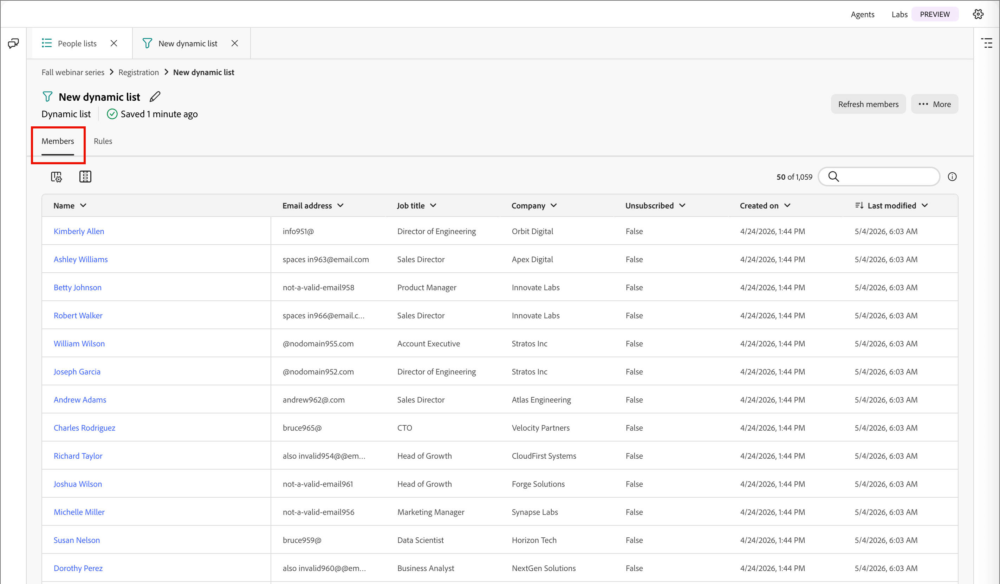
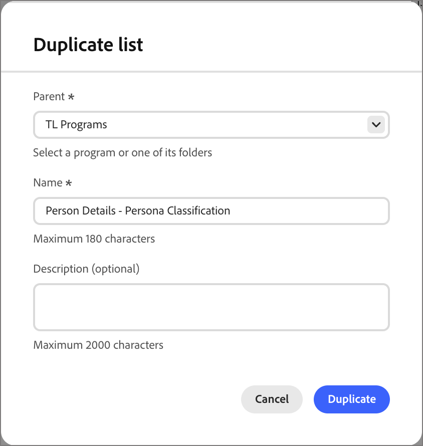

# Listas de pessoas

No [!DNL Adobe Marketo Optimizer], as listas de pessoas são os contêineres de público-alvo em nível de pessoa para direcionamento e entrada de jornada de pessoa, com listas dinâmicas para qualificação ao vivo baseada em regras e listas estáticas para associação fixa ou gerenciada por jornada.

## Acessar e procurar listas de pessoas {#access-browse}

1. Na navegação à esquerda, expanda **[!UICONTROL Gerenciamento de marketing]**.

1. À direita na lista de recursos de **[!UICONTROL Marketing]**, selecione **[!UICONTROL Listas de pessoas]**.

   {width="800" zoomable="yes"}

Há duas guias para a página onde você pode exibir e gerenciar **[!UICONTROL Listas dinâmicas]** e **[!UICONTROL Listas estáticas]**. Clique na guia para alternar a exibição de lista entre os dois tipos.

Você pode digitar texto na ferramenta _Pesquisa_ na parte superior da lista para filtrar a lista exibida por nome. Use as ferramentas de lista para personalizar a lista exibida:

* Clique no ícone _Personalizar tabela_ (  ) para controlar as colunas exibidas.
* Clique no ícone _Redefinir colunas_ (  ) para redefinir as larguras da coluna.

Nesse espaço, também é possível:

* Criar novas listas dinâmicas e estáticas
* Listas de acesso para revisar a associação atual
* Aplicar filtros de associação

<!--
## Audience Hub

The AI Audience Hub is a centralized, AI-driven starting point for all audience-related capabilities across [!DNL Adobe Marketo Optimizer]. It is designed to accelerate first-time user success while progressively unlocking advanced intelligence, insights, and control for returning and power users.

The Hub acts as:

* A guided starting point for discovering, creating, and refining person lists, account lists, and buying groups

* A visibility layer for audience health, coverage, overlap, engagement patterns, and AI-driven insights

* A control center for audience governance, optimization, reuse, and readiness for activation across journeys and sales workflows

### High level structure

Prompt-based starting point - Quick Start prompts and freeform input to help users discover, create, or optimize audiences.

1. AI insights feed - Surfaces key audience signals such as overlap, gaps, saturation risk, and optimization opportunities.

1. Adaptive audience library - A personalized view of people lists, account lists, and buying groups that adapts based on usage, relevance, and activation.

1. Optimization and arbitration nudges - Guides users to refine, split, or reuse audiences before activation.

1. Audience visibility and reporting - High-level insight into audience health, engagement patterns, and usage across active journeys.

### Empty and Error States (High-Level)

No audiences / no data - Show Quick Start prompts to help first-time users create or import person lists

Low data or incomplete audience - Explain what's missing (e.g., insufficient contacts, missing persona coverage, or low engagement data) and suggest next steps.

AI insights unavailable - Provide a graceful fallback with a clear explanation, so users understand why insights aren't shown and what actions they can take manually.
-->

## Criar uma lista de pessoas {#create-people-list}

1. Clique em **[!UICONTROL Criar lista]** na parte superior direita da página _[!UICONTROL Listas de pessoas]_.

1. Na caixa de diálogo, selecione um programa como **[!UICONTROL Pai]** para a lista.

1. Insira um **[!UICONTROL Nome]** (obrigatório) e uma **[!UICONTROL Descrição]** (opcional) para a lista.

1. Escolha a lista **[!UICONTROL Tipo]**:

   * [**[!UICONTROL Estático]**](#static-lists) - A associação é determinada por filtros qualificados avaliados quando você cria a lista. A associação à lista não é atualizada a menos que você qualifique ou desqualifique registros manualmente.
   * [**[!UICONTROL Dinâmico]**](#dynamic-lists) - A associação é determinada dinamicamente por filtros qualificados. A associação à lista é atualizada automaticamente.

   {width="450"}

1. Clique em **[!UICONTROL Criar]**.

>[!NOTE]
>
>No momento, não há suporte para exclusão e duplicação em listas de pessoas nesta versão do Beta.

## Listas estáticas {#static-lists}

A associação de lista estática é definida por filtros simples que fazem referência a atributos e atividades de pessoas. A associação não é alterada, a menos que você qualifique ou desqualifique membros manualmente.

>[!NOTE]
>
>As definições de filtro de lista estática são aplicadas apenas uma vez quando você adiciona ou remove membros da lista. O filtro definido não fica disponível posteriormente. Se quiser manter uma definição de público-alvo consistente usando filtros, use uma lista dinâmica.

<!--
What internet says about Marketo static lists -- which of these is also true in Marketo Optimizer?

* Manual Targeting: Storing fixed cohorts, such as attendees of a specific webinar, people who purchased a certain product, or a list of competitors.
* Third-Party Syncing: Allowing external platforms (like Amplitude or Twilio Segment) to automatically sync and export groups of users directly into Marketo as targeted audiences.
* Status Tracking: Helping marketers organize leads into specific categories or track multi-value interests without needing to create new, permanent database fields.List 
* Segmentation: Acting as a reliable, unchanging recipient or suppression list for email campaigns and engagement programs. Unlike a Smart List—which dynamically adds or removes people based on changing criteria or rules—a static list serves as a reliable snapshot. People remain on the list until explicitly added or removed by you or a backend flow.

So far, activating to a destination is the only thing that they are used for that I have found.
-->

### Adicionar membros {#static-list-add-members}

1. Abra a lista estática e clique em **[!UICONTROL Adicionar pessoas]** na parte superior direita.

1. Na caixa de diálogo, defina as regras para qualificar seus leads arrastando e soltando filtros da esquerda.

   É possível filtrar pessoas usando qualquer combinação de:

   * Histórico de atividades
   * Atributos da empresa
   * Atributos da pessoa
   * Filtros especiais, como associação de jornada

   Para cada filtro adicionado, clique em **[!UICONTROL Adicionar restrições]** para refinar os critérios de correspondência do filtro.

   {width="700" zoomable="yes"}

1. Para salvar as alterações, clique em **[!UICONTROL Concluído]**.

1. Selecione a guia **[!UICONTROL Membros]**.

   Após um breve período, os membros qualificados serão exibidos na lista.

   {width="700" zoomable="yes"}

### Remover membros {#static-list-remove-members}

1. Abra a lista estática e clique em **[!UICONTROL Remover pessoas]** na parte superior direita.

1. Na caixa de diálogo _[!UICONTROL Remover pessoas]_, adicione os filtros para corresponder a membros que você deseja desqualificar.

   {width="700" zoomable="yes"}

1. Para salvar as alterações, clique em **[!UICONTROL Concluído]**.

1. Selecione a guia **[!UICONTROL Membros]**.

   Após um breve período, os membros desqualificados deixam a lista.

### Ativar para um destino {#static-list-activate}

Quando você ativa uma lista estática, ela é acionável em sistemas downstream, com sincronização contínua em vez de exportações manuais. Isso é útil para direcionamento de mídia paga, supressão e orquestração downstream.

* A lista estática atua como um container para as pessoas.
* A ativação envia/sincroniza essa associação com um destino.
* O destino pode então fazer algo com essas pessoas, como direcioná-las no LinkedIn ou removê-las de um público externo.

Como o modelo de ativação deve ser persistente, não uma exportação única:

* As pessoas adicionadas à lista posteriormente são propagadas automaticamente.
* As pessoas removidas posteriormente são desativadas automaticamente.
* Os profissionais de marketing evitam exportações de CSV repetidas e uploads manuais.
* O Jornada pode atualizar o público ao longo do tempo para uma orquestração contínua.

>[!PREREQUISITES]
>
>Você deve ter um ou mais [destinos configurados](./destinations.md) para sua sandbox do [!DNL Marketo Optimizer] antes de ativar uma lista estática para um destino.

1. Selecione a guia **[!UICONTROL Listas estáticas]**.

1. Localize a lista estática que deseja ativar para um destino.

1. Clique no ícone _Mais menu_ ( **...** ) ao lado da lista e escolha **[!UICONTROL Ativar para destino]**.

   {width="450"}

   Você também pode abrir a lista estática e usar o menu _[!UICONTROL Mais]_ no canto superior direito.

   <!-- which UI is it?  _Activate_ (  ) icon next to the static list name. -->

1. Marque a caixa de seleção da conexão de destino configurada.

   {width="600" zoomable="yes"}

1. Clique em **[!UICONTROL Salvar]**.

1. Confirme a ativação na caixa de diálogo _[!UICONTROL Ativar lista para destino]_ clicando em **[!UICONTROL Ativar]**.

Quando a ativação for concluída, uma confirmação será exibida (_O destino foi ativado._) e o destino está listado como **[!UICONTROL Ativo]** na guia **[!UICONTROL Destinos]** da lista. Uma lista estática pode ser ativada para mais de um destino por vez; a associação é sincronizada com todos eles.

Para examinar os destinos nos quais uma lista estática está ativada, abra a lista e selecione a guia **[!UICONTROL Destinos]**. Por padrão, uma nova lista não tem destinos conectados.

#### Desativar um destino {#deactivate-destination}

1. Abra a lista estática e selecione a guia **[!UICONTROL Destinos]**.

1. Clique no ícone _menos_ ( **-** ) na linha do destino que você deseja remover.

1. Confirme na caixa de diálogo _[!UICONTROL Desativar destino]_.

A desativação remove o destino da lista. As pessoas na lista também são removidas do público-alvo de destino conectado.

## Listas dinâmicas {#dynamic-lists}

A associação de lista dinâmica é definida usando filtros simples que fazem referência a atributos e atividades de pessoas. A associação é mantida automaticamente ao qualificar e desqualificar leads de acordo com a lógica do filtro.

### Definir regras de associação {#set-membership-rules}

1. Abra a lista dinâmica e selecione a guia **[!UICONTROL Regras]**.

1. Clique em **[!UICONTROL Editar regras]**.

   {width="550" zoomable="yes"}

1. Na caixa de diálogo, defina as regras para qualificar seus leads arrastando e soltando filtros da esquerda.

   Você pode qualificar leads para a lista usando qualquer combinação de:

   * Histórico de atividades
   * Atributos da empresa
   * Atributos da pessoa
   * Filtros especiais, como associação de jornada

   Para cada filtro adicionado, clique em **[!UICONTROL Adicionar restrições]** para refinar os critérios de correspondência do filtro.

   {width="700" zoomable="yes"}

1. Para salvar as alterações, clique em **[!UICONTROL Concluído]**.

1. Selecione a guia **[!UICONTROL Membros]**.

   Após um breve período, os membros qualificados serão exibidos na lista.

   {width="700" zoomable="yes"}

   Para abrir a página [detalhes da pessoa](./person-details.md), onde você pode exibir o resumo e as atividades recentes, clique no nome de uma pessoa na lista.

### Duplicação de uma lista dinâmica {#duplicate-dynamic-list}

Para uma lista dinâmica, uma ação duplicada é semelhante a uma função clone. Use esta função para replicar a filtragem de associação e adicioná-la a um programa diferente.

1. Na guia _[!UICONTROL Listas dinâmicas]_, clique no ícone _Mais menu_ ( **...** ) ao lado da lista e escolha **[!UICONTROL Duplicar]**.

1. Na caixa de diálogo, selecione o programa **[!UICONTROL Pai]** para a lista duplicada.

1. Insira um **[!UICONTROL Nome]** exclusivo (obrigatório) e uma **[!UICONTROL Descrição]** (opcional).

   Por padrão, a caixa de diálogo usa o nome da lista de origem anexada com `_copy`. Insira um nome exclusivo diferente para a lista, conforme necessário.

   {width="375"}

1. Clique em **[!UICONTROL Duplicar]**.
