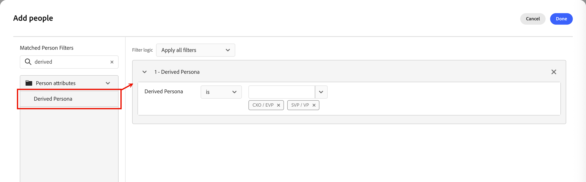
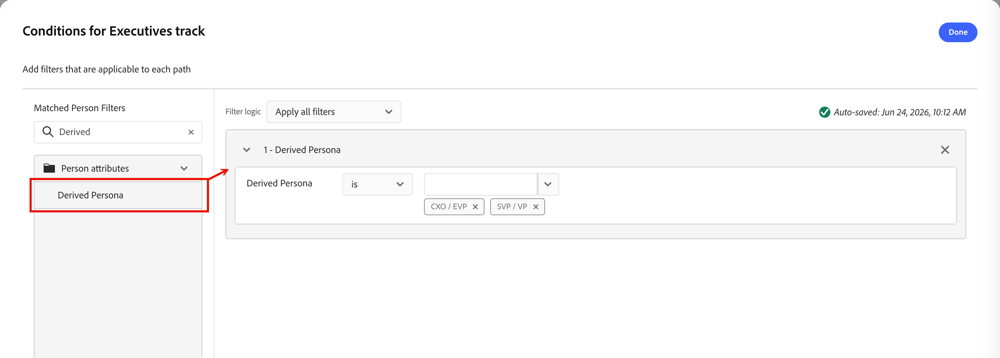

# Personas derivadas

A classificação personalizada transforma dados brutos do cliente em dados semânticos do comprador, entendendo que a IA pode usar para gerar contexto e impulsionar decisões personalizadas em cada canal e jornada. Esse perfil unificado capacita:

* _Ramificação da Jornada_ - Dividir caminhos de clientes em potencial por persona, profundidade de participação e função
* _Arbitragem de Jornada_ - Determina a qual jornada de criação um cliente potencial pertence neste momento, evitando colisões de mensagens entre programas simultâneos
* _Personalização de conteúdo_ - Conteúdo que é narrativas específicas de função (&quot;para um executivo&quot; ou &quot;para um profissional&quot;)
* _Contexto do Sales Qualifier_ - Os representantes de desenvolvimento de negócios (BDRs) recebem um resumo em uma tela mostrando a identidade do indivíduo, seus interesses e seu estágio atual na jornada do comprador

## Personas padrão {#default-ersonas}

Para a versão Beta do Marketo Otimizer, as seguintes personas padrão são definidas de acordo com o atributo de título do cargo:

| Persona | Cargos |
| ------- | ---------- |
| [!UICONTROL CXO/EVP] | CEO, CIO, CTO, CMO, CFO, vice-presidente executivo de estratégia |
| [!UICONTROL VP/VP] | Vice-presidente de marketing, vice-presidente de vendas, vice-presidente de operações, vice-presidente de produtos, vice-presidente de TI |
| [!UICONTROL Gerente/Gerente sênior] | Gerente de marketing sênior, gerente de TI, gerente de operações, gerente de vendas, gerente de RH |
| [!UICONTROL Colaborador Individual] | Executivo de contas, engenheiro de software, especialista em marketing, representante de sucesso do cliente |
| [!UICONTROL Analista] | Analista de negócios, Analista de dados, Analista de pesquisa de mercado, Analista financeiro, Analista de operações |
| [!UICONTROL Desenvolvedor] | Desenvolvedor front-end, desenvolvedor back-end, desenvolvedor de pilha completa, desenvolvedor de aplicativos móveis, engenheiro de DevOps |
| [!UICONTROL Equipe profissional] | Especialista de RH, consultor jurídico, analista de conformidade, gerente de projeto, especialista em aquisição |
| [!UICONTROL Consultor] | Consultor de gerenciamento, consultor de TI, consultor de processos de negócios, consultor de marketing |
| [!UICONTROL Outras] | Especialista do setor, consultor independente, consultor independente, especialista no assunto |

>[!NOTE]
>
>Na próxima versão de Disponibilidade geral, você poderá editar qualquer um desses perfis padrão de acordo com as necessidades da sua organização. Também oferecerá suporte a definições e mapeamento de persona personalizados.

## Filtrar por persona derivada {#derived-persona-filter}

[!DNL Marketo Optimizer] deriva um perfil para cada registro de pessoa avaliando os atributos de registro em relação aos perfis definidos. Você pode usar o resultado inferido — a _Pessoa derivada_ — como filtro ao definir o público-alvo para uma lista de pessoas ou para segmentação em uma jornada de pessoa.

O filtro _[!UICONTROL Persona Derivada]_ aparece no painel de filtro na categoria **[!UICONTROL Atributos de pessoa]**.

### Listas de pessoas {#people-lists}

Ao gerenciar membros em uma [lista estática de pessoas](./people-lists.md#static-lists) ou definir regras para uma [lista dinâmica de pessoas](./people-lists.md#dynamic-lists), você pode filtrar por _Pessoa Derivada_ para direcionar todas as pessoas cujos atributos correspondam a uma persona específica configurada.

{width="750" zoomable="yes"}

**Lista estática — Adicionar membros**

1. Abra a lista estática e clique em **[!UICONTROL Adicionar pessoas]** na parte superior direita.

1. Na caixa de diálogo de filtro, expanda **[!UICONTROL Atributos de pessoas]** e arraste **[!UICONTROL Persona derivada]** para a tela.

1. Na condição de filtro, escolha **[!UICONTROL é]** e selecione uma ou mais personalidades na lista.

1. Clique em **[!UICONTROL Concluído]** para aplicar o filtro e qualificar as pessoas correspondentes na lista.

**Lista dinâmica — Definir regras de associação**

1. Abra a lista dinâmica e selecione a guia **[!UICONTROL Regras]**.

1. Clique em **[!UICONTROL Editar regras]**.

1. Na caixa de diálogo de filtro, expanda **[!UICONTROL Atributos de pessoas]** e arraste **[!UICONTROL Persona derivada]** para a tela.

1. Na condição de filtro, escolha **[!UICONTROL é]** e selecione uma ou mais personalidades na lista.

1. Clique em **[!UICONTROL Concluído]** para salvar a regra.

   A associação é atualizada automaticamente à medida que os registros de pessoa são avaliados em relação à regra.

### Jornadas de pessoas {#person-journeys}

Ao configurar a segmentação para uma jornada de pessoa em um nó [_Dividir caminhos_](../marketing/split-merge-paths-nodes.md), você pode usar uma pessoa derivada como um filtro de perfil de pessoa para controlar quais pessoas entram no caminho de jornada.

{width="750" zoomable="yes"}

1. Clique no nó **[!UICONTROL Split paths]** na tela de jornada.

1. No painel de propriedades do nó à direita, clique em **[!UICONTROL Aplicar condição]** ou **[!UICONTROL Editar condição]** para um caminho.

1. Na caixa de diálogo de filtro, expanda **[!UICONTROL Atributos de pessoas]** e arraste **[!UICONTROL Persona derivada]** para a tela.

1. Na condição de filtro, escolha **[!UICONTROL é]** e selecione uma ou mais personalidades na lista.

1. Clique em **[!UICONTROL Concluído]** para salvar o filtro para o caminho.

