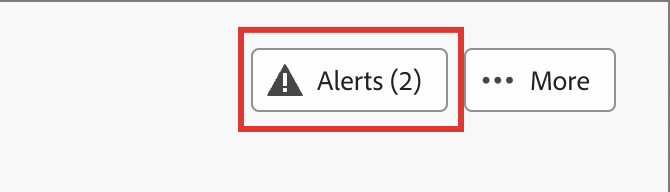
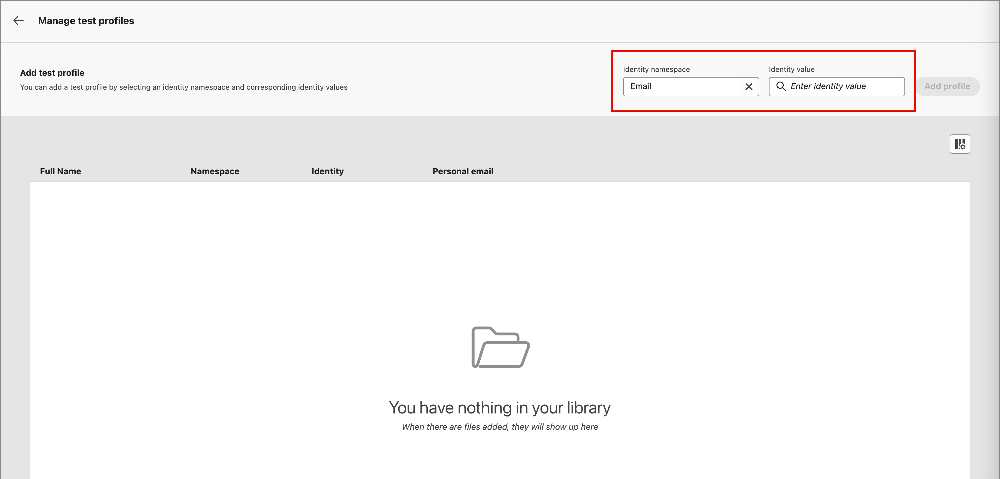
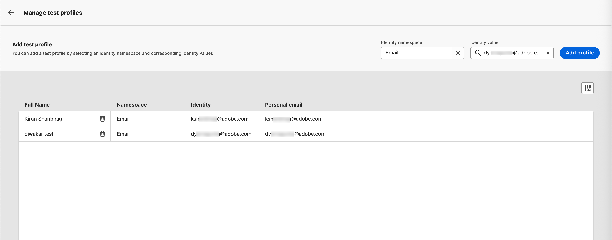

# Criar e publicar páginas de destino

Como profissional de marketing, você pode definir e publicar páginas que deseja incorporar em suas jornadas. Ao adicionar uma nova página de aterrissagem, você configura a página principal e quaisquer subpáginas, projeta o conteúdo, testa-o e o publica.

>[!BEGINSHADEBOX]

## Pré-requisitos da página de destino {#landing-page-prerequisites}

Antes de os profissionais de marketing criarem páginas de aterrissagem para oferecer suporte a suas jornadas, as seguintes configurações e ativos devem estar em vigor:

* [Subdomínio da página de aterrissagem](../admin/configuration-presets-landing-pages.md#lp-subdomains) - Configure um subdomínio dedicado à hospedagem das páginas de aterrissagem.
* [Predefinição de página de aterrissagem](../admin/configuration-presets-landing-pages.md#lp-presets) - Uma predefinição define o subdomínio e outras configurações aplicadas às suas páginas de aterrissagem.
* [Formulário](./forms.md) (para casos de uso de captura de dados) - Obrigatório quando você deseja incorporar um formulário em uma página de aterrissagem e enviar dados para o Experience Platform.

>[!ENDSHADEBOX]

## Criar uma página de destino {#create-landing-page}

>[!CONTEXTUALHELP]
>id="ajo-b2b-prime_lp_create"
>title="Definir e configurar a página de destino"
>abstract="Para criar uma página de destino, você precisa selecionar uma predefinição, configurar a página principal e as subpáginas e, por fim, testar a página antes de publicá-la."

Para direcionar membros de um público-alvo do jornada para uma página da Web definida quando clicarem em um link específico, crie uma página de aterrissagem no [!DNL Marketo Optimizer].

>[!IMPORTANT]
>
>Antes de criar sua primeira landing page, conclua a configuração da landing page. Isso inclui configurar um subdomínio para hospedar suas páginas de aterrissagem e definir pelo menos uma predefinição que especifique o subdomínio e outras configurações de canal. Selecione uma predefinição ao criar a landing page. Para obter a configuração do administrador, consulte [Configuração da página de aterrissagem](../admin/configuration-presets-landing-pages.md).
>
>Para casos de uso de captura de dados, crie um [formulário](./forms.md) antes de incorporá-lo a uma página de aterrissagem.

_Para criar uma página de aterrissagem :_

1. Vá para a navegação à esquerda e selecione **[!UICONTROL Gerenciamento de conteúdo]** > **[!UICONTROL Páginas de aterrissagem]**.

1. Na lista de páginas de aterrissagem, clique em **[!UICONTROL Criar página de aterrissagem]**.

1. Insira um **[!UICONTROL Título]** (obrigatório) e uma **[!UICONTROL Descrição]** (opcional).

   Critérios de título e descrição:

   * **Título** — Máximo de 100 caracteres. Deve ser exclusivo (não diferencia maiúsculas de minúsculas).
   * **Descrição** — Máximo de 300 caracteres.
   * São permitidos caracteres Alpha, numéricos e especiais.
   * Os caracteres reservados **_não são permitidos_**: `\ / : * ? " < > |`

   {width="600"}

1. Selecione uma **[!UICONTROL Predefinição]**.

   Um administrador [cria predefinições de página de aterrissagem](../admin/configuration-presets-landing-pages.md#lp-presets) para definir o subdomínio e outras configurações usadas para páginas de aterrissagem. Selecione uma predefinição e clique em **[!UICONTROL Exibir predefinição]** para revisar suas configurações e confirmar se elas correspondem aos requisitos da página de aterrissagem.

1. Clique em **[!UICONTROL Criar]**.

   A página principal e suas propriedades são exibidas. Saiba como [definir as configurações da página principal](#configure-primary-page).

   {width="700" zoomable="yes"}

1. Para adicionar uma subpágina (por exemplo, uma página de agradecimento ou de erro), clique no ícone **+**.

   É possível adicionar até duas subpáginas por página de aterrissagem.

Depois de configurar e projetar a página principal e quaisquer subpáginas, [teste sua página de aterrissagem](#test-landing-page) antes de publicá-la.

>[!CAUTION]
>
>Você não pode acessar sua landing page copiando e colando o URL definido em um navegador da Web, mesmo que a página seja publicada. Teste a página usando a função de visualização conforme descrito em [Testar a página de aterrissagem](#test-landing-page).

## Configurar a página principal {#configure-primary-page}

>[!CONTEXTUALHELP]
>id="ajo-b2b-prime_lp_primary_page"
>title="Definir as configurações da página principal"
>abstract="Defina a página principal, que é exibida imediatamente quando um destinatário clica no link da página de destino, como de um email ou site."

>[!CONTEXTUALHELP]
>id="ajo-b2b-prime_lp_access_settings"
>title="Definir o URL da página de destino"
>abstract="Nesta seção, defina um URL de página de destino exclusivo. A primeira parte do URL requer que você configure anteriormente um subdomínio da página de destino como parte da predefinição selecionada."

A página principal é a página imediatamente exibida quando um recipient clica no link da página de aterrissagem, como de um email ou site.

_Para definir as configurações de página primária :_

1. Altere o **[!UICONTROL Nome da página]** de acordo com suas necessidades, que é a _Página principal_ por padrão.

1. Defina a parte final do URL da página.

   A predefinição selecionada determina a primeira parte do URL. Um administrador configura o [subdomínio da página de aterrissagem](../admin/configuration-presets-landing-pages.md#lp-subdomains) como parte da predefinição.

   >[!CAUTION]
   >
   >O URL da landing page deve ser exclusivo.
   >
   >Você não pode acessar sua landing page copiando e colando esse URL em um navegador da Web, mesmo que a página seja publicada. Teste-o usando a função de visualização, conforme descrito em [Testar a página de aterrissagem](#test-landing-page).

1. Se quiser uma página de aterrissagem anônima, desabilite a opção **[!UICONTROL Requer usuários identificados]**.

1. Clique no ícone _Calendário_ (  ) para definir a **[!UICONTROL Expiração da página]**.

   Após selecionar uma data de expiração, escolha a ação após a expiração da página:

   * **[!UICONTROL URL de redirecionamento]** - Digite a URL da página para usar como redirecionamento.

     {width="400"}

   * **[!UICONTROL Erro do navegador]** - Digite o texto do erro a ser exibido no lugar da página.

     {width="400"}

## Escolha o tipo de design de conteúdo {#choose-design-type}

Para adicionar o _[!UICONTROL Conteúdo]_ da página, clique em **[!UICONTROL Abrir o Designer]**. O processo de design começa com a escolha do início:

* [Criar do zero](#design-from-scratch)
* [Importar HTML](#import-html)

{width="800" zoomable="yes"}

Depois de selecionar seu método preferido para iniciar o design da página de aterrissagem, use as ferramentas de design visual para [concluir o conteúdo da página](./landing-page-design.md).

### Criar do zero {#design-from-scratch}

Use o espaço de design de conteúdo visual para definir a estrutura e o conteúdo da landing page. Ao adicionar e mover componentes estruturais com ações simples de arrastar e soltar, é possível projetar o layout e a organização do conteúdo da página em segundos.

1. Na página inicial de design, selecione a opção **[!UICONTROL Design do zero]**.

1. [Adicionar estrutura e conteúdo](./landing-page-design.md#structure-content-landing-page) à página.

1. [Revise e edite o rastreamento de URL vinculado](./landing-page-design.md#linked-url-tracking).

1. [Testar a página de aterrissagem](#test-landing-page).

Quando estiver satisfeito com o conteúdo, clique em **[!UICONTROL Salvar]**.

### Importar HTML {#import-html}

<!-- originally  from   /help/_includes/content-design-import.md but copied and revised to omit the part about Marketo Engage assets and AEM assets -->

O conteúdo importado pode ser:

* Um arquivo HTML com uma folha de estilos incorporada
* Um arquivo .zip que inclui um arquivo HTML, a folha de estilos (.css) e as imagens

  >[!NOTE]
  >
  >Não há restrições na estrutura do arquivo .zip. No entanto, as referências devem ser relativas e se encaixar na estrutura de árvore da pasta .zip. As imagens são sempre carregadas no [repositório de ativos](./digital-asset-management.md).

_Para importar um arquivo com conteúdo HTML :_

1. Na página inicial de design, selecione a opção **[!UICONTROL Importar HTML]**.

1. Arraste e solte o HTML ou arquivo .zip contendo seu conteúdo HTML e clique em **[!UICONTROL Importar]**.

{width="500"}

>[!NOTE]
>
>Usar uma marca `<table>` como a primeira camada em um arquivo do HTML pode causar perda de estilo, incluindo configurações de plano de fundo e largura na marca de camada superior.

Você pode personalizar o conteúdo importado conforme necessário com as ferramentas de design visual.

## Verificar alertas {#check-alerts}

À medida que você projeta o conteúdo da página de aterrissagem, os alertas são exibidos na parte superior direita, quando as principais configurações estão ausentes.

{width="250"}

Se você não vir esse botão, não há problemas detectados.

Há dois tipos de alertas:

* **_Avisos_** que se referem a recomendações e práticas recomendadas, como:

  * `Placeholder links are present in the landing page body`: não se esqueça de substituir os espaços reservados por links válidos.

  * `Text version of HTML is empty`: não se esqueça de definir uma versão de texto do corpo da página, que é usada quando o conteúdo do HTML não pode ser exibido.

  * `Empty link is present in page body`: verifique se todos os links na sua página estão corretos.

* **_Erros_** que impedem que você teste ou ative a jornada enquanto não forem resolvidos, como:

  * `The landing page content is empty`: o conteúdo da página é obrigatório.

## Testar a página de destino {#test-landing-page}

>[!CONTEXTUALHELP]
>id="ajo-b2b-prime_preview_lp_profiles"
>title="Visualizar e testar a página de destino"
>abstract="Após definir as configurações e o conteúdo da página de destino, use perfis de teste para visualizar a página."

Quando as configurações e o conteúdo da landing page são definidos, você pode usar perfis de teste para visualizar a página. Se você inseriu [conteúdo personalizado](./landing-page-design.md#personalize-content), é possível verificar como esse conteúdo é exibido na página de aterrissagem usando os dados do perfil de teste.

>[!PREREQUISITES]
>
>Para visualizar e testar páginas de aterrissagem, você deve ter a permissão **[!UICONTROL Publicar mensagens]** e um conjunto de dados definido que contenha perfis de teste.

1. Clique em **[!UICONTROL Visualizar e testar]** para abrir a seleção de perfil de teste.

   >[!NOTE]
   >
   >Você também pode usar **[!UICONTROL Simular conteúdo]** quando estiver no espaço de design visual.

1. Na tela _[!UICONTROL Simular]_, selecione um perfil de teste.

   {width="700" zoomable="yes"}

   Se os perfis necessários não estiverem listados, clique em **[!UICONTROL Gerenciar perfis de teste]** para usar um endereço de email de perfil de teste conhecido e adicioná-lo à lista.

   +++Adicionar perfis de teste

   Para o **[!UICONTROL Namespace de identidade]**, clique no ícone _Selecionar_ (  ) e escolha o namespace `Email` a ser usado para testar perfis.

   {width="700" zoomable="yes"}

   No campo **[!UICONTROL Valor de identidade]**, insira o endereço de email para identificar o perfil de teste e clique em **[!UICONTROL Adicionar perfil]**. Você pode repetir isso para adicionar vários perfis.

   {width="700" zoomable="yes"}

   Clique na seta para trás na parte superior esquerda para retornar à página _[!UICONTROL Simular]_.

   +++

1. Selecione **[!UICONTROL Abrir visualização]** para testar a página de aterrissagem.

   A pré-visualização da landing page é aberta em uma nova guia. Os dados do perfil de teste selecionado substituem os elementos personalizados.

   {width="600"}

1. Selecione outros perfis de teste para visualizar a renderização de cada variante da página de aterrissagem.

## Publicar a página {#publish-landing-page}

>[!PREREQUISITES]
>
>Para publicar páginas de aterrissagem, você deve ter a permissão **[!UICONTROL Publicar Mensagens]**. Antes de publicar, [verifique e resolva todos os alertas](#check-alerts).

Quando a página de rascunho atender aos seus critérios e você quiser disponibilizá-la para vinculação nas mensagens do jornada, clique em **[!UICONTROL Publicar]** na parte superior direita. Na caixa de diálogo de confirmação, clique em **[!UICONTROL Publicar]** novamente para confirmar.

{width="250"}

Quando a página de aterrissagem é publicada, ela é exibida na lista de páginas de aterrissagem com o status **_[!UICONTROL Publicado]_**. Isso significa que ele está ativo e pronto para ser usado em um email ou mensagem SMS enviada por meio de uma jornada.

Não é possível acessar a landing page publicada copiando e colando o URL em um navegador da Web. Você pode testá-lo a qualquer momento usando a [função de visualização](#test-landing-page).
