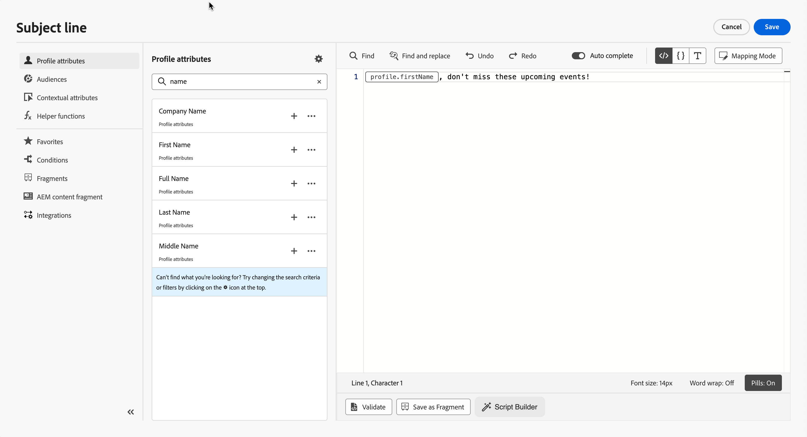

# Editor de personalização

>[!CONTEXTUALHELP]
>id="ajo-b2b-prime_personalization_editor"
>title="Sobre o editor de personalização"
>abstract="O editor de personalização permite selecionar, organizar, personalizar e validar atributos de perfil para criar conteúdo personalizado."

O editor de personalização é a peça central de personalização em [!DNL Marketo Optimizer]. Use-o sempre que precisar de conteúdo dinâmico — em emails, mensagens de WhatsApp, páginas de aterrissagem e campos de URL.

Na interface do editor de personalização, você pode selecionar, organizar, personalizar e validar atributos de perfil para criar conteúdo personalizado.

{width="700" zoomable="yes"}

>[!NOTE]
>
>Somente atributos de perfil estão disponíveis no editor de personalização nesta versão do Beta. A personalização no nível da conta e os dados de objeto personalizado não estão disponíveis. Consulte [Limitações atuais](../marketing/email-channel.md#limitations).

Você pode adicionar personalização em qualquer campo com o ícone _Personalizar_ (  ). Expanda as seções a seguir para obter mais detalhes.

+++Emails e mensagens de WhatsApp

Em [emails](./email-authoring.md#personalize-content) e [mensagens de WhatsApp](./whatsapp-authoring.md#personalize-message-content), a personalização pode ser adicionada em locais diferentes, como o campo **[!UICONTROL Linha de assunto]** em um email ou parâmetros dinâmicos em um modelo de WhatsApp aprovado.

Ele também pode ser adicionado em outras seções do conteúdo, incluindo texto do corpo do email, pré-cabeçalhos e URLs de botão.

+++

+++Espaço de design de conteúdo

Ao editar conteúdo visual, você pode adicionar personalização na maioria dos elementos de texto usando o ícone na barra de ferramentas contextual.

<!--  -->

+++

+++URLs

[!DNL Marketo Optimizer] também permite que você personalize **URLs** em suas mensagens. Os URLs personalizados levam os destinatários para páginas específicas de um site ou para um microsite personalizado, dependendo dos atributos do perfil.

<!-- {width="50%"} -->

>[!NOTE]
>
>A personalização de URL está disponível para estes tipos de links: **Link externo**, **Link de unsubscription** e **Opt-Out**.

+++

+++Configuração de email

Ao criar uma [configuração de canal de email](../admin/email-channel-configuration.md), você pode definir valores personalizados para subdomínios, cabeçalhos e parâmetros de rastreamento de URL.

+++

## Adicionar personalização {#add}

>[!CONTEXTUALHELP]
>id="ajo-b2b-prime_perso_editor_autocomplete"
>title="Preenchimento automático"
>abstract="Ativar essa opção permite que o sistema sugira e conclua automaticamente o código à medida que você digita. Esse recurso está disponível apenas para os formatos HTML e Texto e é compatível com atributos de perfil. Se desabilitado por meio do botão de alternância, o editor fornecerá preenchimento automático do código HTML nativo."

O espaço de trabalho central é onde você cria sua sintaxe de personalização. Para usar um atributo para personalizar sua mensagem, localize-o no painel de navegação esquerdo e clique no botão `+` para adicioná-lo à expressão.

<!--  -->

O menu de reticências ao lado do ícone `+` permite obter mais detalhes para cada atributo e adicionar os atributos usados com mais frequência aos favoritos. Os atributos adicionados aos favoritos podem ser acessados pelo menu **[!UICONTROL Favoritos]** no painel de navegação.

>[!NOTE]
>
>Por padrão, o painel de atributos mostra apenas atributos preenchidos. Para exibir todos os atributos, selecione o botão **[!UICONTROL Configurações]** no painel de atributos e desative a opção **[!UICONTROL Mostrar apenas atributos preenchidos]**.

Além disso, você pode definir um texto de fallback padrão que será exibido se um atributo de perfil do tipo string estiver vazio. Para fazer isso, clique no botão de reticências ao lado do atributo e selecione **[!UICONTROL Inserir com texto alternativo]**. Escreva o texto que deve ser exibido por padrão se o valor do atributo estiver vazio para um perfil e clique em **[!UICONTROL Adicionar]**.

<!--  -->

Por exemplo, você pode cumprimentar cada destinatário pelo nome usando `{{profile.firstName}}` com um fallback quando o valor estiver ausente: `{{profile.firstName | default: "there"}}`.

## Opções para edição de expressão {#options}

O espaço de trabalho central fornece várias ferramentas para ajudar você a escrever sua expressão de personalização.

<!--  -->

As opções disponíveis são:

1. **[!UICONTROL Localizar]** / **[!UICONTROL Localizar e substituir]**: pesquise pela expressão e substitua automaticamente partes do código.
1. **[!UICONTROL Desfazer]** / **[!UICONTROL Refazer]**: Desfazer / Refazer a última operação.
1. **[!UICONTROL Preenchimento automático]**: sugere e conclui automaticamente o código à medida que você digita. Esse recurso está disponível apenas para os formatos HTML e Texto e é compatível com atributos de perfil. Se desabilitado por meio do botão de alternância, o editor fornecerá preenchimento automático do código HTML nativo.

   <!-- {width="70%" align="center" zoomable="yes"} -->

1. **[!UICONTROL HTML]** / **[!UICONTROL JSON]** / **[!UICONTROL Text]**: identifique o formato do seu código. Isso permite que o sistema adapte a validação e o recurso de preenchimento automático com base no idioma selecionado.
1. **[!UICONTROL Validar]**: verifique a sintaxe da sua expressão.
1. **[!UICONTROL Tamanho da fonte]**: ajusta o tamanho da fonte do conteúdo dentro do editor para melhorar a leitura.
1. **[!UICONTROL Quebra de texto]**: habilita ou desabilita a quebra automática de linha, permitindo que expressões longas sejam exibidas em uma única linha ou quebra automática no editor. As opções incluem:
   * **Desativado** (Padrão) - Sem quebra automática de linha. As linhas longas se estendem além da exibição do editor e exigem rolagem horizontal.
   * **Em** - Quebra linhas na largura do editor.
   * **Coluna de quebra automática de linha** - Quebra as linhas quando uma linha atinge 80 caracteres.
   * **Limitado** - Quebra as linhas na largura do editor ou em 80 caracteres, o que for menor.
1. **[!UICONTROL Pills]**: exibir atributos como &quot;pílulas&quot; compactas para melhorar a legibilidade, ocultando caminhos de atributos longos. Clique em um atributo para exibir seu caminho completo.

   >[!NOTE]
   >
   >Essa opção só está disponível para atributos de perfil.

No painel de navegação, recursos adicionais estão disponíveis para ajudar você a criar sua expressão de personalização.

<!--  -->

* **[!UICONTROL Funções auxiliares]** - As funções auxiliares permitem executar operações em dados, como cálculos, formatação de dados ou conversões, condições e manipulá-las no contexto da personalização.

* **[!UICONTROL Favoritos]** - Os atributos adicionados aos favoritos são exibidos nesta lista. Isso permite acessar rapidamente os itens usados com mais frequência. Para adicionar um atributo aos favoritos, clique no menu de reticências e escolha **[!UICONTROL Adicionar aos favoritos]**.

O Colaborador pode gerar expressões Handlebars a partir de descrições em linguagem simples, explicar expressões existentes e identificar possíveis problemas.

Quando a expressão de personalização estiver pronta, clique em **[!UICONTROL Confirmar]** ou **[!UICONTROL Inserir]** para adicioná-la ao conteúdo.

## Mecanismos de validação {#validation-mechanisms}

A validação da sua expressão é executada automaticamente quando você clica em **[!UICONTROL Confirmar]** ou **[!UICONTROL Inserir]** para fechar o editor. Você também pode clicar em **[!UICONTROL Validar]** para verificar a sintaxe de personalização antes de fechar.

Para obter alertas de conteúdo que bloqueiam a ativação de jornadas, consulte [Validação de conteúdo de email](./email-authoring.md#validation).

Expanda a seção a seguir para ver os erros comuns que podem ocorrer ao validar a personalização.

+++Erros comuns

* **Caminho &quot;XYZ&quot; não encontrado**

Esse erro ocorre quando você faz referência a um campo que não está definido no esquema.

Nesse caso, **firstName1** não está definido como um atributo no esquema de perfil:

```handlebars
{{profile.firstName1}}
```

* **Incompatibilidade de tipo para a variável &quot;XYZ&quot;. Matriz esperada. Cadeia de caracteres encontrada.**

Esse erro ocorre ao tentar iterar em uma cadeia de caracteres em vez de em uma matriz.

Neste caso, **jobTitle** é uma cadeia de caracteres, não uma matriz:

```handlebars
{{#each profile.jobTitle as |item|}}
  {{item}}
{{/each}}
```

* **Sintaxe de manipuladores inválida. Encontrado`'[XYZ}}'`**

Este erro ocorre quando a sintaxe Handlebars inválida é usada.

```handlebars
{{[profile.firstName}}
```

+++
