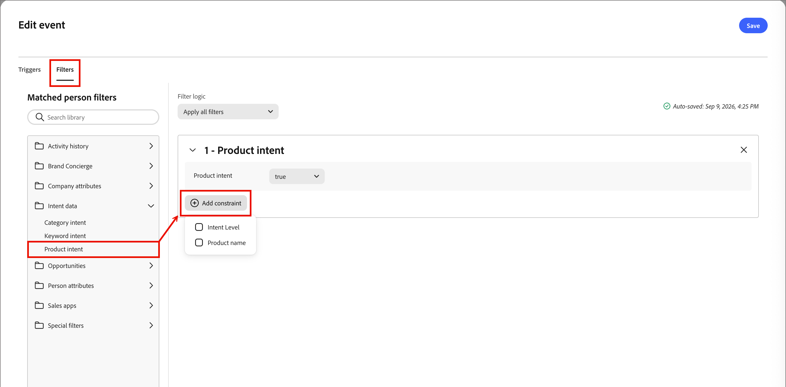

# Ouvir um nó de evento

Adicione o nó _Ouvir um evento_ para mover o público-alvo para a próxima etapa da jornada quando ocorrer um evento.

## Acionadores de eventos {#event-triggers}

Você pode criar acionadores para [!DNL Marketo Engage] atividades, como:

* Preenche o formulário - Acionado quando uma pessoa envia um formulário do [!DNL Marketo Engage] na sua página de aterrissagem.
* Visitas à página da Web - acionado quando um cliente potencial exibe uma página da Web rastreada (você pode especificar URLs exatos ou usar curingas).
* Link de cliques - acionado quando um link rastreado em um email de marketing é clicado.
* Alterações no valor de dados - Acionado quando um campo específico (como Status do lead, Pontuação ou Setor) é atualizado no registro de uma pessoa.
* Campanha solicitada - geralmente usado para integrações de API ou webhook, esse acionador inicia uma campanha quando outro programa ou serviço da Web a chama.
* Pontuação alterada - Acionado quando a pontuação de um lead individual aumenta ou diminui após um determinado limite.
* Com toque por push em dispositivo móvel - Acionado em campanhas inteligentes de marketing móvel quando uma notificação por push recebe interação em um dispositivo.

## Filtros de evento {#event-filters}

| Filtros | Descrição |
| ------- | ----------- |
| Histórico de atividades > Email | Atividades de email com base nas condições avaliadas usando uma ou mais mensagens de email selecionadas: <li>Clicou em um link no email <li>Email aberto |
| Histórico de atividades > Valor de dados alterado | Para um atributo de pessoa selecionado, ocorreu uma alteração de valor. Esses tipos de alterações incluem: <li>Novo valor <li>Valor anterior <li>Motivo <li>Fonte <li>Data da atividade <li> Número número de vezes |

## Adicionar um nó de evento {#add-event-node}

1. Navegue até a tela de jornada.

1. Clique no ícone de adição ( **+** ) em um caminho e escolha **[!UICONTROL Ouvir um evento]**.

   {width="200"}

1. Nas propriedades do nó à direita, clique em **[!UICONTROL Adicionar critério de evento]**.

1. Na caixa de diálogo _[!UICONTROL Editar evento]_, adicione os eventos a serem acionados.

   {width="600" zoomable="yes"}

1. (Opcional) Selecione a guia **[!UICONTROL Filtros]** na caixa de diálogo e adicione critérios de filtragem para os acionadores.

1. Clique em **[!UICONTROL Editar evento]** e defina os detalhes do evento.

   {width="600" zoomable="yes"}

1. Clique em **[!UICONTROL Salvar]**.

<!--
1. If needed, set the **[!UICONTROL Timeout]** option to limit the time period to listen for the event.

   >[!NOTE]
   >
   >The journey ends after a timeout unless you define a timeout path, where you can add other nodes.

   Enable the **[!UICONTROL Timeout]** option and select the duration for which the journey waits for an event to occur before it times out.

   You can choose to end the path here or take a different course of action by setting another path. To create a new path in the journey where you can add actions and events applicable to accounts when the event does not occur, select the **[!UICONTROL Set timeout path]** check box.

   {width="700" zoomable="yes"}
-->

>[!NOTE]
>
>No momento, a funcionalidade de tempo limite do Listen para um nó de evento não funciona. Está planejado para uma versão posterior.

