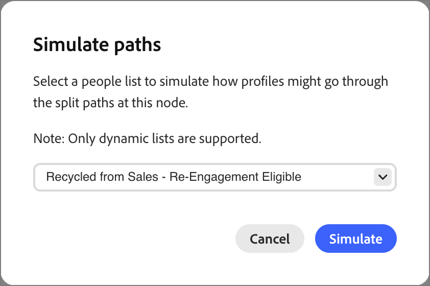

# Próximo nó de melhor caminho

Em [!DNL Marketo Optimizer], o nó *Próximo melhor caminho* traz a decisão de caminho dividido orientada por IA diretamente para a tela de jornada. Em vez de configurar condições de filtro em um nó [caminhos divididos](./split-merge-paths-nodes.md), descreva sua intenção em linguagem natural e permita que o sistema determine o caminho mais relevante para cada pessoa.

Na compra B2B, um perfil pode parecer ser um tipo de comprador, mas seu comportamento, dados firmográficos e contexto de engajamento revelam uma história mais sutil. O próximo nó de melhor caminho avalia esse contexto para tomar uma decisão de roteamento inteligente, permitindo revisar, modificar ou substituir qualquer recomendação de IA antes de ativar a jornada.

## Decisão de caminho {#path-decisioning}

Há três etapas para ir da intenção à ativação.

* **Etapa 1: definir caminhos** — Adicione um nó Próximo Melhor Caminho à jornada, nomeie cada caminho e escreva um prompt de linguagem natural descrevendo quem deve progredir pelo caminho. É possível adicionar ou remover caminhos a qualquer momento.

* **Etapa 2: Simular** — Escolha um público-alvo de exemplo e execute uma simulação. Você vê as contagens de perfil por caminho, as pontuações de confiança e o raciocínio da IA, para validar a lógica antes da ativação.

  >[!NOTE]
  >
  >A simulação é executada somente em dados de amostra e nunca afeta a execução da jornada em tempo real.

* **Etapa 3: Ativar** — Publique a jornada em relação ao seu público real. A IA avalia cada pessoa no tempo de execução, atribui o caminho de melhor ajuste em tempo real e um fallback padrão garante que ninguém seja excluído de um caminho.

### Entradas da decisão sobre IA {#ai-decisioning-inputs}

Quando uma pessoa atinge o nó, o sistema busca o contexto do perfil, aplica restrições e usa um LLM para selecionar o caminho de melhor ajuste. A IA avalia cada pessoa usando uma combinação das seguintes entradas:

* **Histórico de engajamento** - Aberturas de email, cliques em links, visitas a páginas da Web e outros sinais comportamentais das jornadas atuais e anteriores
* **Sinais em tempo real** - Eventos de alta intenção, como preenchimentos de formulários e preços de visitas a páginas
* **Atributos do perfil** - Dados demográficos, cargo, persona e firmográficos
* **Atributos da conta** - Dados firme e tecnológico associados à conta da pessoa

### Criação de contexto de IA {#ai-context-building}

Como suporte à decisão de roteamento, a IA constrói uma camada inferida para cada perfil. Ele combina dados demográficos e firmográficos, detalhes da conta e sinais comportamentais (como detalhes da pessoa, intenção do problema e intenção do produto) em um resumo contextual para essa pessoa. Usando esse contexto enriquecido, a IA pode direcionar cada pessoa para o caminho ideal e fornecer uma pontuação de confiança e o raciocínio em linguagem natural por trás de cada decisão.

Cada decisão é registrada com uma pontuação de confiança e raciocínio em linguagem natural para transparência e observabilidade.

Se nenhum caminho for uma correspondência forte ou se o prompt fizer referência a dados não disponíveis para um perfil, a pessoa será roteada para o caminho de fallback padrão.

## Adicionar um próximo nó de melhor caminho {#add-node}

1. Abra a jornada de pessoa e navegue até a tela de jornada.

1. Clique no ícone de adição ( **+** ) em um caminho e escolha **[!UICONTROL Próximo melhor caminho]**.

   {width="200"}

   O nó é adicionado à tela e o painel de configuração da divisão de IA é aberto à direita. Ele começa com um caminho e um caminho padrão *Outras pessoas* para rotear pessoas que não se qualificam para nenhum dos caminhos definidos.

## Configurar caminhos {#configure-paths}

Para cada caminho, defina um nome e um prompt de linguagem natural que descreva quem deve ser roteado para lá. A entrada de prompt substitui totalmente a interface da condição de filtro; não há condições de atributo a serem configuradas.

1. Para o primeiro caminho, insira as propriedades no cartão de caminho no painel direito:

   * Insira um **[!UICONTROL Rótulo]** que reflita o público ou a intenção para esse segmento.

   * Digite um **[!UICONTROL Prompt]** em linguagem natural descrevendo quem pertence a este caminho. Concentre-se na intenção e no resultado, não em valores de atributo específicos.

   {width="500"}

1. Clique em **[!UICONTROL Adicionar caminho]** para cada caminho adicional que você deseja incluir.

   Para remover um caminho, clique no ícone *Excluir* (  ) no cartão de caminho.

   Adicione o rótulo e o prompt para cada caminho.

   **O exemplo solicita uma divisão de três caminhos:**

   * *Caminho 1 - Líderes de RH:* Identifique as pessoas nas funções de liderança de RH com maior probabilidade de se envolver com gerenciamento de talentos e conteúdo de experiência do funcionário.
   * *Caminho 2 - Avaliadores técnicos:* identifique as partes técnicas mais propensas a interagir com a arquitetura do produto, as integrações e o conteúdo de implementação.
   * *Caminho 3 - Tomadores de decisão empresariais:* identifique as partes interessadas mais propensas a se envolver com ROI, resultados de negócios e conteúdo de estudo de caso.

   {width="600"}

1. Se necessário, reordene os caminhos para definir a ordem de prioridade para correspondência.

   A filtragem de caminho é avaliada em ordem decrescente. Cada pessoa continua pelo primeiro caminho que corresponde a. Clique nas setas para cima e para baixo na parte superior direita de cada cartão de caminho para movê-lo para cima ou para baixo na lista.

1. Revise o caminho padrão **[!UICONTROL Outras pessoas]** (último na lista de caminhos) e altere o rótulo, se necessário.

   O caminho padrão é usado quando a IA não consegue atribuir uma pessoa com confiança a qualquer caminho definido ou quando os dados relevantes não estão disponíveis. Quando um prompt faz referência a dados que não existem no conjunto de dados de um determinado perfil, o sistema roteia esse perfil para o caminho padrão e sinaliza a lacuna de dados.

>[!BEGINSHADEBOX]

**Controles humanos no loop**

As recomendações de IA não são vinculativas. Antes de ativar a jornada, é possível:

* Para refinar a lógica de roteamento, edite qualquer prompt de caminho.
* Adicionar, remover ou reordenar caminhos.
* Substitua as sugestões de IA por condições personalizadas, conforme necessário.

As atribuições de caminho orientadas por IA não entrarão em vigor até que você publique a jornada.

>[!ENDSHADEBOX]

## Avisar exemplos por caso de uso {#prompt-examples}

Os exemplos a seguir mostram como gravar prompts de caminho efetivos em casos de uso comuns de marketing B2B. Use-os como pontos de partida e adapte o idioma para corresponder ao contexto da jornada e aos dados do público-alvo.

* &quot;Identifique as pessoas envolvidas com sites de RH (shrm.org, hbr.org/topic/human-resource-management) e [!DNL Journey Optimizer] nos últimos 30 dias, que provavelmente participarão de um webinário sobre IA em Operações de RH e que estejam interessadas em produtos de IA.&quot;

* &quot;Identifique pessoas que têm envolvimento em sites de finanças (wsj.com/finance,investopedia.com), interessadas em [!DNL Marketo Engage] nos últimos 30 dias, que provavelmente participarão de um webinário sobre IA no Financial Planning. Eles também deveriam ter mostrado algum interesse em produtos de IA.&quot;

* &quot;Identifique as pessoas envolvidas com sites de Risco/Pesquisa (mckinsey.com/capabilities/risk-and-resilience, forrester.com/research) e [!DNL GenStudio] nos últimos 30 dias, que provavelmente participarão de um webinário sobre IA em Gerenciamento de Riscos e que estejam interessadas em produtos de IA.&quot;

## Simular decisão antes de publicar {#simulate}

Use a simulação para testar como a IA avalia seus prompts em relação a um público-alvo real antes da jornada entrar em funcionamento. A simulação está disponível somente enquanto a jornada está no status *Rascunho* e não tem efeito em nenhuma jornada publicada.

### Executar uma simulação {#run-simulation}

1. Selecione o próximo nó do melhor caminho e clique no ícone *Simular* (  ) na parte superior do painel direito.

1. Na caixa de diálogo, escolha uma lista dinâmica para usar no público-alvo da simulação.

<!-- 
   * **[!UICONTROL Original person lists]** – Use the audience from the audience node. Specify a sample size when the full audience exceeds the simulation threshold.
   * **[!UICONTROL Dynamic and static lists]** – Use a [!DNL Marketo Engage] static or dynamic list.
   * **[!UICONTROL Test records]** – Use AI-suggested test profiles.
-->

{width="250"}

>[!NOTE]
>
>* Se o público-alvo selecionado exceder o limite de simulação, o sistema executará a simulação em uma amostra de 100 perfis. Um indicador na interface do usuário mostra que os resultados são baseados em amostras.
>* Se o público selecionado ainda não for materializado, a simulação será bloqueada. Um aviso em linha direciona você para materializar o público-alvo primeiro.

1. Clique em **[!UICONTROL Simular]**.

### Revisar resultados da simulação {#review-results}

Depois que a simulação é executada, o painel direito exibe a distribuição de perfis em cada caminho e o raciocínio da IA por trás dessas atribuições:

| Resultado | Descrição |
|---|---|
| **Perfis** | O número de perfis roteados para o caminho. |
| **Dividir** | A porcentagem de perfis roteados para o caminho. |
| **Confiança** | O nível de confiança de IA para a atribuição de caminho. A confiança reflete a atualização dos dados, a intensidade e a consistência do sinal e o sucesso histórico de padrões de roteamento semelhantes. |
| **Aviso** | O prompt que foi avaliado para o caminho. |
| **Raciocínio de IA** | Uma explicação em linguagem natural do por quê os perfis foram atribuídos coletivamente a esse caminho. |

{width="600"}

>[!NOTE]
>
>Quando os dados disponíveis ou o escopo limitam uma decisão, os resultados incluem informações sobre a limitação. Por exemplo, quando um atributo necessário não está presente no conjunto de dados, os resultados incluem um indicador explícito explicando como os dados ausentes afetaram os resultados.

Use os resultados para refinar os prompts e confirmar se o roteamento reflete o resultado pretendido. Você pode modificar prompts de caminho e executar novamente a simulação quantas vezes forem necessárias antes de publicar.

## Publicar e monitorar a jornada {#publish-monitor}

Após validar os resultados da simulação:

1. Conecte o público-alvo de pessoas ao nó de entrada da jornada.

1. [Publique a jornada](./person-journeys.md#publish).

Depois que a jornada estiver ativa, o nó do próximo melhor caminho será executado no tempo de execução. À medida que cada pessoa atinge o nó, a IA os avalia em tempo real usando os sinais mais recentes e os direciona para o caminho mais relevante.

Para uma jornada publicada, abra a tela de jornada e selecione o próximo nó de melhor caminho para exibir a seção **_[!UICONTROL Resultados finais]_** no painel direito. Os resultados finais mostram:

* A distribuição percentual dos perfis em cada caminho
* A pontuação de confiança para cada atribuição de caminho
* Raciocínio em nível de caminho e de perfil, com detalhes expansíveis para perfis individuais

{width="600"}

Os resultados ao vivo também estão disponíveis por meio da habilidade de Observabilidade do Jornada na [interface de chat do Coworker](../agents/chat-interface.md).
