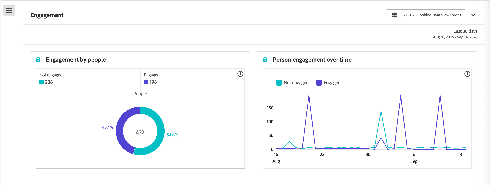

# Relatório de engajamento

Use o relatório [!UICONTROL Envolvimento] para analisar como as pessoas se envolvem com seus programas de marketing, incluindo o engajamento por pessoa e as tendências de engajamento ao longo do tempo.

_Para exibir o relatório :_

1. Na navegação à esquerda, selecione **[!UICONTROL Relatórios]**.
1. Clique no ícone _Lista_ (  ) e selecione **[!UICONTROL Envolvimento]** no painel _[!UICONTROL Índice]_.

## Blocos de relatório {#report-tiles}

O relatório [!UICONTROL Envolvimento] inclui dois blocos.

* **[!UICONTROL Participação de Pessoas]** - Mostra a participação entre as pessoas da sua instância.
* **[!UICONTROL Engajamento com as pessoas ao longo do tempo]** - Mostra como o engajamento das pessoas muda com o tempo.

>[!NOTE]
>
>Não há filtros disponíveis neste relatório. As opções de filtragem estão planejadas para uma versão futura.

{width="700" zoomable="yes"}

Você pode [alterar o intervalo de datas](./reports-overview.md#change-the-date-range) para cada bloco de relatório.

Selecione **[!UICONTROL Compartilhar]** na parte superior do relatório para baixar ou agendar uma exportação de todos os dados do relatório. Consulte [_Exportar um relatório_](./reports-overview.md#export-a-report) na visão geral de Relatórios.
