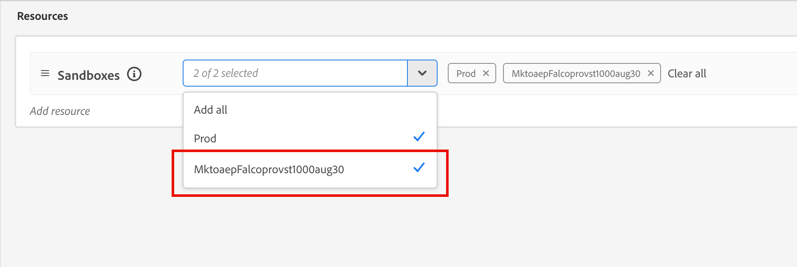

# Acesso e permissões do usuário

Após a conclusão do provisionamento e a associação das sandboxes, conclua as etapas a seguir para fornecer acesso ao [!DNL Marketo Optimizer] para sua equipe e usuários.

1. [Crie um [!DNL Marketo Optimizer] perfil de produto](#create-profile) na Admin Console (somente instalação única/inicial).
1. [Adicionar um grupo de usuários](#add-user-group) na Admin Console.
1. [Atribuir o perfil de produto](#assign-profile) ao grupo de usuários na Admin Console.
1. [Adicionar usuários ao novo grupo](#add-users) na Admin Console.
1. [Editar funções internas](#edit-role-permissions) ou [criar uma função personalizada](#create-a-custom-role) com permissões de produto e a sandbox [!DNL Marketo Optimizer] necessária no Experience Platform.
1. [Adicionar usuários](#add-users-to-a-role) ou [grupos](#add-user-groups-to-a-role) a funções no Adobe Experience Platform.

## Configurar o perfil do produto {#config-profile}

Como administrador, você pode concluir essas tarefas no [!DNL Adobe Admin Console], que é um local central para administrar e gerenciar licenças e usuários de produtos da Adobe. No Admin Console, é possível criar e gerenciar usuários em um único local em vez de em várias soluções individuais. Para saber mais sobre suas funções e recursos, consulte a página [visão geral do Admin Console](https://helpx.adobe.com/br/business/enterprise/deploy-apps-updates.html).

### Acessar o Admin Console {#admin-console}

Antes de usar o Admin Console para administrar os usuários da sua equipe, é necessário garantir que você possa acessar o Admin Console e ter as permissões apropriadas.

1. Como administrador do sistema, você deve receber vários emails do Adobe como parte do processo de integração.

   Localize o email de boas-vindas que fornece informações sobre o nome da organização à qual você recebeu acesso.

1. Clique no link **[!UICONTROL Introdução]** no email de boas-vindas para navegar até a Admin Console.

   Se não conseguir localizar o email, abra um navegador diretamente na Admin Console em [https://adminconsole.adobe.com](https://adminconsole.adobe.com).

1. Faça logon usando sua Adobe ID.

   Depois de fazer logon, você verá a página _Visão geral_ da Adobe Admin Console.

1. Se você tiver acesso a várias organizações, verifique se fez logon na organização correta.

   Para alterar a organização, clique no nome dela no canto superior direito e escolha a organização que você precisa acessar.

1. Selecione **[!UICONTROL Administradores]** no cartão _[!UICONTROL Usuários]_ para verificar se você é um administrador do sistema.

   {width="800" zoomable="yes"}

1. Pesquise inserindo seu email, nome de usuário, nome ou sobrenome do Adobe ID.

   * Se o acesso estiver configurado corretamente, a pesquisa retornará seu registro.

   * Se o valor na coluna **[!UICONTROL FUNÇÃO DE ADMINISTRADOR]** mostrar `System`, isso quer dizer que você (ou o usuário mostrado) é um administrador do sistema.

### Criar o perfil de produto [!DNL Marketo Optimizer] {#create-profile}

Ao conceder aos usuários acesso a uma solução da Adobe, você pode não pretender conceder acesso total a eles. Os perfis de produto permitem que cada solução tenha seu próprio conjunto de permissões do usuário. Use o Admin Console para atribuir perfis de produto.

Para obter mais informações sobre como usar perfis de produtos para direitos de usuário, consulte [_Gerenciar perfis de produto para usuários corporativos_](https://helpx.adobe.com/br/business/enterprise/products-entitlements/manage-product-profiles/product-profiles.html){target="_blank"} na documentação do Admin Console.

{width="30"} Um administrador de sistema ou administrador de produto do [!DNL Experience Platform] pode executar as seguintes etapas em [https://adminconsole.adobe.com](https://adminconsole.adobe.com).

1. Selecione a guia **[!UICONTROL Produtos]**.

1. Abra a instância [!DNL Marketo Optimizer] onde deseja adicionar o perfil e clique em **[!UICONTROL Novo perfil]**.

1. Insira um nome de perfil de produto, como _Acesso_.

1. Clique em **[!UICONTROL Avançar]** e depois em **[!UICONTROL Salvar]**.

### Adicionar um grupo de usuários {#add-user-group}

Um grupo de usuários é uma coleção de usuários aos quais é concedido um conjunto compartilhado de permissões. Você pode adicionar ou remover usuários em seu grupo de usuários. As permissões do grupo permanecem as mesmas enquanto os usuários no grupo são alterados.

Para obter mais informações sobre como os grupos de usuários são usados para gerenciar permissões, consulte [Gerenciar grupos de usuários](https://helpx.adobe.com/br/business/enterprise/users/users-and-groups/user-groups.html){target="_blank"} na documentação do Admin Console.

{width="30"} Um administrador do sistema pode executar as seguintes etapas em [https://adminconsole.adobe.com](https://adminconsole.adobe.com).

1. Selecione a guia **[!UICONTROL Usuários]**.

1. Escolha **[!UICONTROL Grupos de Usuários]** na navegação à esquerda.

1. Clique em **[!UICONTROL Novo grupo de usuários]** na parte superior direita.

1. Insira um nome para o grupo de usuários, como _Usuários do Otimizer_, e clique em **[!UICONTROL Salvar]**.

   {width="600" zoomable="yes"}

### Atribuir o perfil de produto {#assign-profile}

{width="30"} Um administrador de produto pode executar as seguintes etapas em [https://adminconsole.adobe.com](https://adminconsole.adobe.com).

1. Clique no grupo de usuários criado.

1. Selecione a guia **[!UICONTROL Perfis de produto atribuídos]** e clique em **[!UICONTROL Atribuir perfil]**.

1. Clique em **+** e adicione cada instância dos seguintes produtos:

   * [!UICONTROL Adobe Marketo Otimizer - Acesso]
   * [!UICONTROL Adobe Experience Platform - AEP-Padrão-Todos-Usuários]
   * [!UICONTROL Coleta de Dados do Adobe Experience Platform - Acesso Total à Coleta de Dados Padrão]
   * [!UICONTROL Adobe Experience Platform - Todo o Acesso à Produção Padrão]

   {width="600" zoomable="yes"}

1. Clique em **[!UICONTROL Salvar]**.

### Adicionar usuários ao novo grupo {#add-users}

Para obter informações sobre o gerenciamento de usuários, consulte [_usuários do Adobe Admin Console_](https://helpx.adobe.com/br/business/enterprise/users/understand-user-management/user-management-overview.html){target="_blank"} na documentação do Admin Console.

{width="30"} Um administrador do sistema ou administrador de produto pode executar as seguintes etapas em [https://adminconsole.adobe.com](https://adminconsole.adobe.com). Um administrador de produto pode adicionar somente usuários que já existem em sua organização.

1. Se os usuários ainda não forem membros da organização, adicione cada usuário:

   * Em _[!UICONTROL Links rápidos]_, clique em **[!UICONTROL Adicionar usuários]**.

   * Insira o endereço de email do usuário e clique em **[!UICONTROL Adicionar como novo usuário]**.

     {width="600" zoomable="yes"}

   * Insira o nome e sobrenome e clique em **[!UICONTROL Salvar]**.

1. Adicionar cada usuário ao grupo:

   * Clique no nome do usuário.

   * Na página de detalhes do usuário, navegue até **[!UICONTROL Grupos de usuários]**.

   * Clique no ícone _Mais_ ( **...** ) à esquerda e escolha **[!UICONTROL Editar grupos de usuários]**.

   * Clique no ícone _Adicionar_ ( **+** ) abaixo de **[!UICONTROL Grupos de usuários]**.

     {width="600" zoomable="yes"}

   * Selecione o grupo de usuários criado anteriormente e clique em **[!UICONTROL Aplicar]**.

   * Clique em **[!UICONTROL Salvar]** para ver as alterações do usuário.

## Atribuir permissões do produto {#assign-product-permissions}

As permissões são direitos unitários que permitem definir as autorizações atribuídas a um perfil de produto. Cada permissão é agrupada em um recurso, como jornadas de pessoas ou conteúdo, representando funcionalidades em [!DNL Marketo Optimizer].

A área _Permissões_ do Adobe Experience Platform é onde os administradores podem definir funções de usuário e políticas de acesso para gerenciar permissões de acesso para recursos e objetos em um aplicativo de produto. Neste aplicativo, você pode criar e gerenciar funções, bem como atribuir as permissões de recurso desejadas para essas funções. As permissões também permitem gerenciar sandboxes e usuários associados a uma função específica.

Para obter mais informações sobre permissões de função no Experience Platform, consulte [Gerenciar permissões de uma função](https://experienceleague.adobe.com/pt-br/docs/experience-platform/access-control/abac/permissions-ui/permissions){target="_blank"} na documentação do Experience Platform.

1. Vá para [experience.adobe.com](https://experience.adobe.com/).

1. No painel _[!UICONTROL Acesso rápido]_, selecione **[!UICONTROL Permissões]**.

   >[!NOTE]
   >
   >Se você não vir _[!UICONTROL Permissões]_, talvez precise clicar em **[!UICONTROL Exibir tudo]** e selecioná-lo nos aplicativos disponíveis.

   {width="700" zoomable="yes"}

### Recursos de permissão {#permissions}

Os recursos de permissão a seguir controlam o acesso aos recursos de configuração de canal, gerenciamento de conteúdo e jornada de pessoas no [!DNL Marketo Optimizer]:

>[!IMPORTANT]
>
>O acesso [!DNL Marketo Optimizer] exige que você habilite uma sandbox específica provisionada usando a seguinte convenção de nomenclatura: `Mktoaep` + prefixo de assinatura [!DNL Marketo Engage]. Por exemplo, se o prefixo de assinatura vinculado do [!DNL Marketo Engage] for _AcmeAssoc_, a sandbox necessária para o acesso do [!DNL Marketo Optimizer] será _MktoepAcmeAssoc_.

| Categoria | Permissão | Descrição |
| -------- | ----------- | ---------- |
| Configurações do canal B2B | Exibir configurações de email B2B | Exibir configurações de email (subdomínios, registros PTR, pools de IP, listas de supressão, listas de propagação, planos de aquecimento de IP). |
| | Gerenciar configurações de email B2B | Defina configurações de email (subdomínios, registros PTR, pools de IP, listas de supressão, listas de propagação, planos de aquecimento de IP). Essas configurações são necessárias antes que os usuários possam enviar emails. |
| | Gerenciar configurações de canais B2B | Acesso ao item de menu _Canais_ na navegação à esquerda e em todas as operações de configuração de canal. |
| | Gerenciar predefinições B2B do WhatsApp | Criar, exibir e excluir predefinições de mensagem do WhatsApp e configurações de SMS associadas. |
| Jornadas B2B | Gerenciar Jornadas de pessoa B2B | Acesso à lista _Jornadas de pessoas_ e a todas as operações de jornada de pessoas. |
| Assets B2B | Exibir modelos de conteúdo | Exibir a lista de modelos de conteúdo e os detalhes. |
| | Gerenciar modelos B2B | Criar, editar e excluir modelos de conteúdo. |
| | Visualizar fragmentos B2B | Visualizar a lista de fragmentos de conteúdo e os detalhes. |
| | Gerenciar fragmentos B2B | Criar, editar e excluir fragmentos de conteúdo. |
| | Publicar fragmentos B2B | Publicar fragmentos de conteúdo para uso em modelos, emails e landing pages. |
| | Exibir Assets B2B | Visualize a biblioteca do Assets e os detalhes do arquivo do ativo. |
| | Gerenciar Assets B2B | Criar, editar e excluir arquivos de ativos. |
| | Visualizar emails B2B | Exibir mensagens de email. |
| | Gerenciar emails B2B | Criar, editar e excluir mensagens de email. |
| | Gerenciar exportação de mensagens B2B | Exporte relatórios de mensagem na seção Email. |
| Biblioteca da Journey Optimizer | Gerenciar itens de biblioteca B2B | Adicionar e excluir expressões salvas na biblioteca. |
| Governança de dados | Gerenciar rótulos de uso de exclusão B2B | Exibir, criar e excluir rótulos de uso de dados (DULE) aplicados a conjuntos de dados e esquemas. |
| Administração de sandbox | Gerenciar pacotes B2B | Criar, exportar, importar, copiar e excluir pacotes de sandbox. |

Para fornecer suporte a destinos externos no [!DNL Marketo Optimizer], as seguintes permissões são necessárias:

| Categoria | Permissão | Descrição |
| -------- | ----------- | ---------- |
| Painéis | Ver Painéis de Controle Padrão | Acesso somente para visualização aos painéis _Perfis_, _Destinos_ e _Segmentos_. Também permite o acesso a _Painéis_ na navegação à esquerda e na guia _Painéis_ do inventário e integrações. |
| | Gerenciar painéis padrão | Adicione atributos personalizados que ainda não estão no data warehouse. |
| Destinos | Exibir destinos | Acesso somente para visualização para exibir os destinos disponíveis na guia _Catálogo_ e destinos autenticados na guia _Procurar_. |
| | Gerenciar destinos | Exibir, criar e excluir conexões de destino e contas de destino. |
| | Ativar destinos | Ativar dados para destinos ativos. _Exibir Destinos_ ou _Gerenciar Destinos_ também são necessários para acessar esta função. |
| | Ativar segmento sem mapeamento | Ative públicos para destinos existentes, sem exibir a etapa de mapeamento. Os usuários podem adicionar e remover públicos-alvo em workflows de ativação, mas não podem adicionar ou remover atributos ou identidades mapeadas. A permissão _Exibir Destinos_ também é necessária para acessar esta função. |
| | Gerenciar e ativar destino do conjunto de dados | Visualize, crie, edite e desative fluxos de exportação de conjunto de dados, bem como ative dados para conjuntos de dados ativos. A permissão _Exibir Destinos_ também é necessária para acessar esta função. |
| | Criação de destino | Capacidade de criar destinos usando o Adobe Experience Platform Destination SDK. |
| Governança de dados | Exibir políticas de uso de dados | Acesso somente para visualização para políticas de uso de dados pertencentes à sua organização. |
| | Gerenciar políticas de uso de dados | Exibir, criar, editar e excluir políticas de uso de dados. |
| Ingestão de dados | Exibir fontes | Acesso somente para visualização a fontes disponíveis na guia _Catálogo_ e fontes autenticadas na guia _Procurar_. |
| | Gerenciar fontes | Exibir, criar, editar e desativar fontes. |
| Gerenciamento de perfil | Exibir configurações do perfil | Acesso somente para visualização a todas as configurações do perfil. |
| | Gerenciar configurações do perfil | Exibir e editar todas as configurações de perfil. |

<!--

### B2B built-in roles {#b2b-built-in-roles}

When your organization has [!DNL Marketo Optimizer] provisioned, Experience Platform includes a set of built-in (default, read-only) roles that you can use to manage access to the product capabilities:

| Role | Permissions |
| ---- | ----------- |
| B2B Journey Manager | <li>Manage B2B Journeys <li>Manage B2B Buying Groups <li>Manage B2B Account Lists <li>View B2B Engagement Dashboard <li>View B2B Insights Dashboard |
| B2B Channel Manager | <li>Manage B2B Assets <li>Manage B2B Templates <li>Manage B2B Fragments |
| B2B System Administrator | <li>Manage B2B Channels Configurations <li>Manage B2B Admin Configurations |

-->

### Editar permissões de função {#edit-role-permissions}

Para funções integradas ou personalizadas, é possível decidir adicionar ou excluir permissões a qualquer momento. Se você modificar uma função padrão ou personalizada, isso afetará cada usuário atribuído à função.

>[!IMPORTANT]
>
>O acesso [!DNL Marketo Optimizer] exige que você habilite uma sandbox específica provisionada usando a seguinte convenção de nomenclatura: `Mktoaep` + prefixo de assinatura [!DNL Marketo Engage]. Por exemplo, se o prefixo de assinatura vinculado do [!DNL Marketo Engage] for _AcmeAssoc_, a sandbox necessária para o acesso do [!DNL Marketo Optimizer] será _MktoepAcmeAssoc_.

>[!NOTE]
>
>Um administrador de produto com acesso às Permissões do Experience Platform pode executar essas etapas.

_Para alterar as permissões de uma função :_

1. Selecione **[!UICONTROL Funções]** na navegação à esquerda.

1. Clique no nome da função **_Usuários do otimizador_**.

1. Na página de detalhes, clique em **[!UICONTROL Editar]** na parte superior direita.

   {width="800" zoomable="yes"}

   No editor de funções, o menu _[!UICONTROL Recursos]_ exibe a lista de recursos que se aplicam aos aplicativos da Experience Cloud - Platform.

1. Selecione a sandbox provisionada para [!DNL Marketo Optimizer] acesso (`Mktoaep<Marketo subscription prefix>`).

   {width="500" zoomable="yes"}

1. Clique no ícone _Adicionar_ (**+**) para cada um dos recursos funcionais.

   {width="700" zoomable="yes"}

1. Adicione as permissões específicas para cada um dos recursos ou selecione **[!UICONTROL Adicionar tudo]**.

1. Clique em **[!UICONTROL Salvar]**.

   <!-- {width="700" zoomable="yes"} -->

1. Clique em **[!UICONTROL Fechar]** para retornar à página de detalhes.

### Adicionar usuários a uma função {#add-users-to-a-role}

{width="30"} Um administrador do sistema ou administrador do Experience Platform pode executar as seguintes etapas.

1. Abra os detalhes da função e selecione a guia **[!UICONTROL Usuários]**.

   Esta guia exibe uma lista de todos os usuários atribuídos à função.

1. Clique em **[!UICONTROL Adicionar usuários]**.

   {width="800" zoomable="yes"}

1. Na caixa de diálogo _[!UICONTROL Adicionar usuários]_, localize e selecione os usuários que deseja adicionar à função.

   * Você pode usar a ferramenta Search para filtrar a lista de usuários.

   * Marque a caixa de seleção de cada usuário.

   {width="600" zoomable="yes"}

1. Clique em **[!UICONTROL Salvar]** quando tiver selecionado todos os usuários que deseja adicionar.

### Adicionar grupos de usuários a uma função {#add-user-groups-to-a-role}

Para obter informações sobre o gerenciamento de usuários, consulte [_usuários do Adobe Admin Console_](https://helpx.adobe.com/br/business/enterprise/users/understand-user-management/user-management-overview.html){target="_blank"} na documentação do Admin Console.

{width="30"} Um administrador do sistema ou administrador do Experience Platform pode executar as seguintes etapas.

1. Abra os detalhes da função e selecione a guia **[!UICONTROL Grupos de usuários]**.

   Esta guia exibe uma lista de todos os grupos de usuários atribuídos à função.

1. Clique em **[!UICONTROL Adicionar grupos]**.

   {width="800" zoomable="yes"}

1. Na caixa de diálogo _[!UICONTROL Adicionar grupos]_, localize e selecione os grupos que deseja adicionar à função.

   * Você pode usar a ferramenta Pesquisar para filtrar a lista de grupos de usuários.

   * Marque a caixa de seleção para cada grupo de usuários.

   {width="600" zoomable="yes"}

1. Clique em **[!UICONTROL Salvar]** quando tiver selecionado todos os grupos que deseja adicionar.

### Criar uma função personalizada {#create-a-custom-role}

{width="30"} Um administrador do sistema ou administrador do Experience Platform pode executar as seguintes etapas.

1. Selecione **[!UICONTROL Funções]** na navegação à esquerda e selecione **[!UICONTROL Criar função]**.

1. Na caixa de diálogo _[!UICONTROL Criar nova função]_, digite um nome para a função, como _Profissionais de marketing B2B_, e uma descrição (opcional).

1. Clique em **[!UICONTROL Confirmar]**.

1. Selecione a sandbox provisionada para [!DNL Marketo Optimizer] acesso (`Mktoaep<Marketo subscription prefix>`).

   {width="500" zoomable="yes"}

1. Adicionar permissões do produto:

   Para determinar quais recursos do produto você deseja para a função, consulte a lista de [permissões do produto](#permissions).

   Na lista _[!UICONTROL Recursos]_ à esquerda, localize os itens B2B e clique no ícone _Adicionar_ (**+**) para adicionar cada atributo que você deseja habilitar para a função.

   Você pode digitar _B2B_ na ferramenta de pesquisa para filtrar a lista de muitas permissões de produtos relacionados a B2B que se aplicam a [!DNL Marketo Optimizer].

   {width="700" zoomable="yes"}

1. Clique em **[!UICONTROL Salvar]** na parte superior direita.

1. Vá para os detalhes da função e selecione a guia **[!UICONTROL Grupos de usuários]**.

1. Clique em **[!UICONTROL Adicionar grupos]**.

1. Marque a caixa de seleção ao lado do grupo de usuários criado anteriormente na Admin Console.

1. Clique em **[!UICONTROL Salvar]**.

Sua função personalizada está configurada e os usuários no grupo atribuído agora podem acessar os recursos do [!DNL Marketo Optimizer] selecionados.
